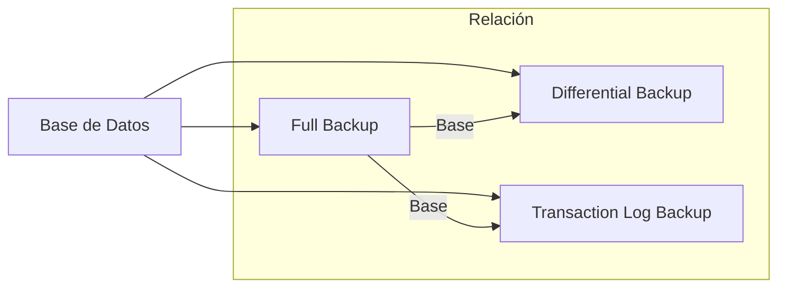

# Backups y Sistemas de Recuperación de Datos 💾

Un sistema de recuperación es el conjunto de técnicas y herramientas diseñadas para restaurar una base de datos a un estado **consistente** tras un fallo de hardware, software o error humano.

---

## 1. ¿Por qué se pierden los datos?

La pérdida de información es una amenaza constante. Los principales vectores de fallo son:

> [!warning] Causas Principales
> - **Errores Humanos:** Borrados accidentales (`DELETE` sin `WHERE`), mala administración de permisos.
> - **Fallos de Software:** Bugs en aplicaciones o caídas del sistema operativo (*system crash*).
> - **Fallos de Hardware:** Rotura física de discos duros o corrupción de memoria.
> - **Factores Externos:** Catástrofes naturales (incendios, inundaciones), robos o ataques de ransomware.

---

## 2. Conceptos Clave de la Recuperación

Para administrar backups, es fundamental entender estos cuatro pilares:

1.  **Registro de Transacciones (Transaction Log):** Un archivo que anota cada cambio (`INSERT`, `UPDATE`, `DELETE`) **antes** de que se escriba en los archivos de datos finales. Es la "caja negra" del sistema.
2.  **Backup (Copia de Seguridad):** Copia física o lógica de los datos guardada en un dispositivo externo.
3.  **Restore (Restauración):** El proceso de volcar un backup sobre una base de datos para recuperar su operatividad.
4.  **Point-in-Time Recovery:** Capacidad de volver exactamente a un segundo específico del pasado (ej: "volver a las 10:59 AM, un segundo antes del error").

---

## 3. Modelos de Recuperación (Recovery Models)

En motores como SQL Server, el modelo de recuperación determina cómo se gestiona el Log de Transacciones:

| Modelo | Descripción | Ventaja | Limitación |
| :--- | :--- | :--- | :--- |
| **Simple** | Trunca el Log automáticamente después de cada transacción confirmada. | Ahorra mucho espacio en disco. | No permite recuperar a un punto específico en el tiempo. |
| **Completo (Full)** | Mantiene todos los cambios en el Log hasta que se haga un backup de dicho Log. | Permite restaurar hasta el último segundo antes del fallo. | Requiere administración constante para que el archivo de Log no llene el disco. |

---

## 4. Métodos de Backup

### A. Copia de Seguridad Completa (Full)
Copia **toda** la base de datos. Es el punto de partida obligatorio para cualquier otro tipo de backup.
- *Dinamismo:* Permite capturar transacciones en curso mientras se realiza la copia.

### B. Copia de Seguridad Diferencial (Diff)
Solo guarda los datos que han cambiado **desde el último backup completo**.
- *Ventaja:* Es mucho más rápida que una copia completa y ahorra espacio.

### C. Copia de Seguridad del Registro de Transacciones (Log)
Copia solo las instrucciones lógicas almacenadas en el Log. 
- *Ventaja:* Es el método más veloz y permite la recuperación a un punto en el tiempo. **Solo disponible en el Modelo Completo.**

### D. Copia de Seguridad de Archivos
Permite respaldar archivos específicos de la BD de forma independiente. Útil en bases de datos masivas (Terabytes) donde hacer un Full Backup de todo el sistema sería inviable diariamente.

---

## 5. Estrategia de Restauración Ideal

Para recuperar un sistema al estado más reciente posible, se debe seguir este orden:
1.  Restaurar el **último Backup Completo** (con `NORECOVERY`).
2.  Restaurar el **último Backup Diferencial** (con `NORECOVERY`).
3.  Restaurar todos los **Backups de Log** realizados después del diferencial, en orden cronológico (el último con `RECOVERY`).

> [!important] Regla de Oro
> Un backup no sirve de nada si no se prueba. Realizar simulacros de restauración periódicos es la única forma de garantizar la **disponibilidad** de los datos.
