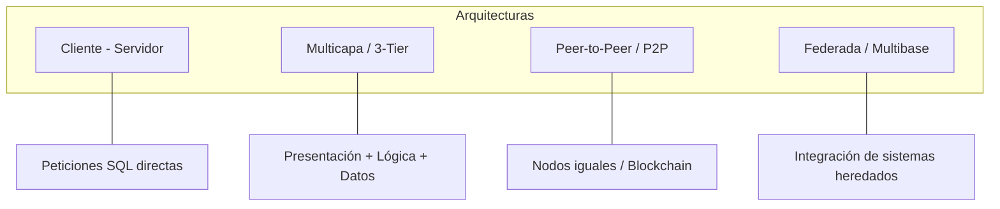

# Bases de Datos Distribuidas (BDD)

## 1. Definición
Una **Base de Datos Distribuida** es un sistema de almacenamiento en el que los datos se encuentran repartidos a lo largo de múltiples ubicaciones físicas o nodos interconectados mediante una red. 

A diferencia de un sistema centralizado, aquí la información se gestiona de forma descentralizada, permitiendo que cada nodo tenga acceso y, en muchos casos, una copia de los datos, garantizando mayor resiliencia y disponibilidad.

---

## 2. Tipos de Bases de Datos Distribuidas

Dependiendo de la uniformidad de su estructura y software, se clasifican en:

| Tipo | Característica Principal | Objetivo |
| :--- | :--- | :--- |
| **Homogéneas** | Mismo software (SGBD) y esquema en todos los nodos. | Ofrecer la vista de una base de datos única y transparente. |
| **Heterogéneas** | Diferentes esquemas o software (SGBD) en los nodos. | Integrar sistemas independientes para proveer funcionalidad unificada. |

---

## 3. Clasificación según Distribución y Réplica

Las estrategias para organizar la información en los nodos son:

1. **Datos Duplicados (Replicación):** Instancias adicionales en diferentes nodos. Reduce tráfico de red y facilita la recuperación ante fallos.
2. **Fragmentación Horizontal:** Distribución de **registros completos** (filas) mediante claves primarias. Ideal para sucursales que solo requieren sus propios datos.
3. **Fragmentación Vertical:** División por **columnas o atributos**. Cada sección debe tener una copia de la clave primaria. Útil para separar datos financieros de datos de contacto.
4. **Datos Reorganizados:** Los datos se ajustan para propósitos específicos, como la transición de sistemas transaccionales (**OLTP**) a sistemas de soporte de decisiones.
5. **Datos de Esquema Separado:** División de la BD y el software por departamentos concretos (ej. Usuarios vs. Productos), aunque pueden existir superposiciones.

---

## 4. Ventajas y Desventajas

> [!success] Ventajas
> - **Disponibilidad:** El sistema funciona aunque fallen algunos nodos.
> - **Escalabilidad Horizontal:** Fácil expansión añadiendo nuevos nodos sin cambiar el hardware existente.
> - **Rendimiento:** Menor latencia al ubicar los datos cerca del usuario geográfico.

> [!danger] Desventajas
> - **Complejidad:** El diseño, configuración y monitoreo son significativamente más difíciles.
> - **Consistencia:** Desafío crítico para mantener los datos sincronizados en tiempo real.
> - **Costos:** Infraestructura de red más robusta y mayor necesidad de almacenamiento.
> - **Seguridad:** Mayor superficie de ataque debido a la naturaleza dispersa.

---

## 5. Modelos de Arquitectura Lógica

---

## 6. Estrategias de Fragmentación Física

Existen tres maneras fundamentales de dividir las tablas:

### A. Fragmentación Horizontal
Divide una tabla en **filas (tuplas)**.
*   *Ejemplo:* Tabla `Clientes_USA` en el Nodo A y `Clientes_LATAM` en el Nodo B.

### B. Fragmentación Vertical
Divide una tabla en **columnas (atributos)**.
*   *Requisito:* Mantener la **Clave Primaria** en todos los fragmentos para permitir la reconstrucción.

### C. Fragmentación Mixta o Híbrida
Es la combinación de las dos anteriores. Es la estrategia estándar para sistemas empresariales de alta complejidad.
