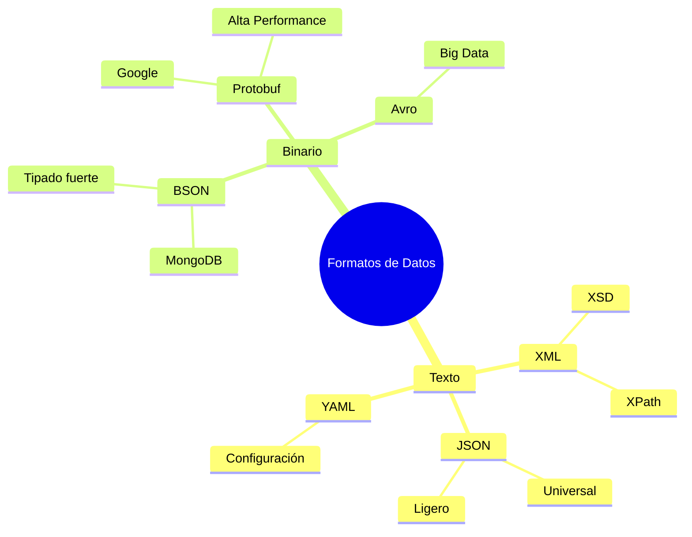
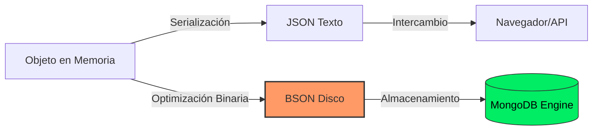

# Formatos de Almacenamiento y Exchange de Datos

En el contexto de las **Bases de Datos II**, la evolución desde el modelo relacional hacia modelos NoSQL y sistemas distribuidos ha popularizado el uso de formatos **semi-estructurados**. Estos formatos permiten mayor flexibilidad, escalabilidad y facilidad para representar jerarquías complejas.

---

## 1. XML (eXtensible Markup Language)

El abuelo de los formatos de intercambio modernos. XML es un lenguaje de marcado que define un conjunto de reglas para codificar documentos de forma legible tanto para humanos como para máquinas.

### Características Principales
- **Autodescriptivo:** Las etiquetas definen la estructura y el significado de los datos.
- **Jerárquico:** Estructura de árbol con un único nodo raíz.
- **Esquemas:** Utiliza **DTD** (Document Type Definition) o **XSD** (XML Schema Definition) para validación.

### Componentes de XML
```xml
<estudiante id="101">
  <nombre>Juan Perez</nombre>
  <carrera>Ingeniería de Software</carrera>
  <materias>
    <materia nota="18">Base de Datos II</materia>
  </materias>
</estudiante>
```

> [!info] Ecosistema XML
> - **XPath:** Para navegar y seleccionar nodos.
> - **XQuery:** El "SQL" de XML para realizar consultas complejas.

---

## 2. JSON (JavaScript Object Notation)

JSON es un formato ligero de intercambio de datos, basado en la sintaxis de objetos de JavaScript, pero totalmente independiente del lenguaje.

### Características Principales
- **Simplicidad:** Más fácil de leer y escribir que XML.
- **Tipos de Datos:** Soporta strings, números, booleanos, nulos, arreglos y objetos.
- **Omnipresente:** Es el estándar *de facto* para APIs REST y bases de datos documentales (como CouchDB).

### Estructura JSON
```json
{
  "estudiante": {
    "id": 101,
    "nombre": "Juan Perez",
    "carrera": "Ingeniería de Software",
    "materias": [
      { "nombre": "Base de Datos II", "nota": 18 }
    ]
  }
}
```

---

## 3. BSON (Binary JSON)

BSON es la extensión binaria de JSON, utilizada principalmente por **MongoDB** como formato de almacenamiento interno y de transferencia de red.

### ¿Por qué BSON?
JSON tiene limitaciones en eficiencia de espacio y tipos de datos (ej. no diferencia entre `float` e `int`, ni tiene tipo `Date`). BSON soluciona esto.

> [!success] Ventajas de BSON
> - **Velocidad de Escaneo:** Incluye prefijos de longitud que permiten "saltar" elementos durante la lectura.
> - **Más Tipos de Datos:** Soporta `Date`, `Binary data`, `ObjectId`, `Decimal128`.
> - **Eficiencia Computacional:** Al ser binario, es más rápido de procesar para la máquina que parsear texto plano.

---

## 4. Comparativa Técnica

| Característica | XML | JSON | BSON |
| :--- | :--- | :--- | :--- |
| **Legibilidad** | Alta (Verbosa) | Muy Alta | Baja (Binario) |
| **Tamaño** | Grande (por etiquetas) | Medio | Optimizado (pero puede ser mayor por metadatos) |
| **Velocidad de Parseo** | Lenta | Rápida | Muy Rápida |
| **Esquema** | Estricto (XSD) | Flexible / Esquema-en-lectura | Flexible |
| **Uso Principal** | Configuración, SOAP | APIs REST, Config | Almacenamiento (MongoDB) |

---

## 5. Otras Variantes y Formatos Modernos

### A. YAML (YAML Ain't Markup Language)
Enfocado 100% en la legibilidad humana. Usa sangría (indentación) en lugar de corchetes o etiquetas.
*   **Uso:** Configuraciones (Docker, Kubernetes, CI/CD).

### B. Protocol Buffers (Protobuf)
Desarrollado por Google. Es binario y requiere un esquema predefinido (`.proto`).
*   **Uso:** gRPC, comunicación interna de microservicios por su extrema rapidez.

### C. Apache Avro
Formato de serialización de datos basado en filas, muy usado en el ecosistema **Big Data** (Hadoop, Kafka). Almacena el esquema junto con los datos.

---

## 6. Diagramas Conceptuales

### Jerarquía de Formatos


### Flujo de Datos: De Objeto a Disco


---

## 7. Resumen de Criterios de Selección

1. **¿Necesitas legibilidad humana extrema?** Usa **YAML**.
2. **¿Vas a transmitir datos por la web a un Front-end?** Usa **JSON**.
3. **¿Necesitas máxima performance y tipos de datos complejos en BD?** Usa **BSON**.
4. **¿Necesitas validación estricta y documentos jerárquicos complejos?** Usa **XML**.
