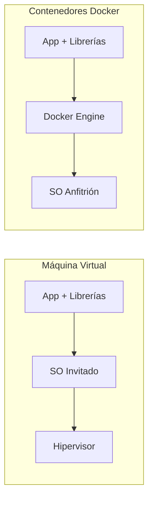

# Guía Completa: Instalación y Uso de Docker 🐳

## 1. ¿Qué es Docker?
**Docker** es una plataforma de código abierto que automatiza el despliegue de aplicaciones dentro de **contenedores**. 

A diferencia de una máquina virtual (VM) que emula un sistema operativo completo, los contenedores comparten el núcleo (kernel) del sistema operativo anfitrión, lo que los hace extremadamente ligeros, rápidos y portátiles.

### Comparativa Rápida


---

## 2. Instalación Paso a Paso

### 🐧 En Linux (Basado en Arch Linux)
Dado que tu sistema actual es Arch Linux, este es el procedimiento estándar:

1.  **Actualizar el sistema:**

    ```bash
   sudo pacman -Syu
    ```

2.  **Instalar Docker:**
    ```bash
    sudo pacman -S docker
    ```

3.  **Iniciar y habilitar el servicio:**
    ```bash
    sudo systemctl start docker
    sudo systemctl enable docker
    ```

4.  **Añadir tu usuario al grupo docker** (para no usar `sudo` siempre):
    ```bash
    sudo usermod -aG docker $USER
    ```
    *Nota: Debes cerrar sesión y volver a entrar para que este cambio surta efecto.*

### 🪟 En Windows
1.  **Requisito previo:** Instalar **WSL 2** (Windows Subsystem for Linux). Abre PowerShell como admin y ejecuta:
    ```powershell
    wsl --install
    ```
2.  **Descargar el instalador:** Ve a [Docker Desktop for Windows](https://docs.docker.com/desktop/install/windows-install/) y descarga el `.exe`.
3.  **Ejecutar el instalador:** Asegúrate de que la opción **"Use WSL 2 instead of Hyper-V"** esté marcada.
4.  **Reiniciar:** El sistema pedirá un reinicio para completar la configuración de WSL y Docker.

---

## 3. Comandos Esenciales (Cheat Sheet)

Aquí tienes los comandos que usarás el 90% del tiempo:

### Gestión de Contenedores
- **`docker ps`**: Lista los contenedores activos.
- **`docker ps -a`**: Lista todos los contenedores (incluyendo los detenidos).
- **`docker run -d --name nombre_contenedor imagen`**: Descarga e inicia un contenedor en segundo plano.
- **`docker stop nombre_o_id`**: Detiene un contenedor.
- **`docker rm nombre_o_id`**: Elimina un contenedor.

### Gestión de Imágenes
- **`docker images`**: Lista las imágenes descargadas localmente.
- **`docker pull nombre_imagen`**: Descarga una imagen desde Docker Hub.
- **`docker rmi nombre_imagen`**: Elimina una imagen.

### Inspección y Logs
- **`docker logs -f nombre_contenedor`**: Ver los logs en tiempo real.
- **`docker exec -it nombre_contenedor bash`**: Entrar a la terminal dentro del contenedor.

---

## 4. Ejemplo Práctico: Levantar una Base de Datos SQL
Si necesitas una instancia de SQL Server rápidamente para la clase:

```bash
docker run -e "ACCEPT_EULA=Y" -e "SA_PASSWORD=TuPasswordSeguro123" \
   -p 1433:1433 --name sql_server_clase \
   -d mcr.microsoft.com/mssql/server:2022-latest
```

> [!tip] Tip de Oro
> Utiliza **Docker Compose** (archivo `docker-compose.yml`) cuando necesites levantar múltiples servicios a la vez (ej: Base de Datos + Interfaz Web de administración).
