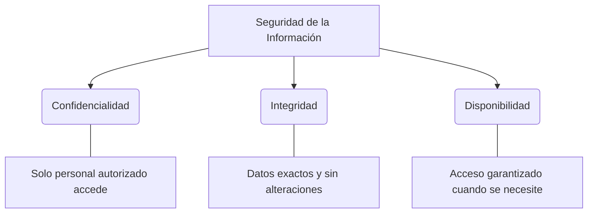

# Seguridad en Sistemas de Gestión de Bases de Datos (SGBD) 🔐

La seguridad en una base de datos no es solo restringir el acceso, sino garantizar que el activo más valioso de una organización —su información— sea veraz, esté disponible y no caiga en manos equivocadas.

---

## 1. Los Tres Pilares de la Seguridad (Tríada CIA)

Cualquier estrategia de seguridad debe fundamentarse en estos tres conceptos:

> [!important] Riesgos por falta de seguridad
> - **Fuga de datos:** Pérdida de propiedad intelectual o datos de clientes.
> - **Ransomware:** Secuestro de información con fines extorsivos.
> - **Sanciones Legales:** Incumplimiento de leyes como el RGPD o leyes locales de protección de datos.
> - **Desprestigio:** Pérdida total de la confianza de los usuarios.

---

## 2. Esquemas (Schemas)
En motores como SQL Server o PostgreSQL, un **esquema** es un contenedor lógico que permite agrupar objetos (tablas, vistas, procedimientos).

- **Propósito:** Separar los objetos por departamentos o funcionalidades (ej: `ventas.Clientes`, `rrhh.Empleados`).
- **Seguridad:** Permite dar permisos sobre todo un esquema en lugar de tabla por tabla, simplificando la administración.

---

## 3. Roles: Gestión Eficiente de Permisos
Un **rol** es una abstracción que agrupa usuarios con necesidades similares. En lugar de asignar permisos a 50 analistas, se crea el rol `Analista_Datos` y se le asignan los permisos una sola vez.

### A. Roles Fijos del Servidor (Nivel Global)
Estos roles controlan acciones que afectan a toda la instancia del servidor.

| Rol | Descripción |
| :--- | :--- |
| **`sysadmin`** | **Control Total.** Puede hacer cualquier cosa en el servidor. |
| **`securityadmin`** | Gestiona inicios de sesión (logins) y auditorías. |
| **`dbcreator`** | Puede crear, alterar, eliminar y restaurar bases de datos. |
| **`diskadmin`** | Administra los archivos físicos en el disco duro. |
| **`serveradmin`** | Configura opciones globales (memoria, puertos, apagado). |
| **`bulkadmin`** | Permite ejecutar operaciones `BULK INSERT` (carga masiva de datos). |

### B. Roles Fijos de la Base de Datos (Nivel Local)
Existen de forma independiente dentro de cada base de datos.

| Rol | Función |
| :--- | :--- |
| **`db_owner`** | Máximo nivel dentro de la BD. Puede hacer todo en esa BD. |
| **`db_accessadmin`** | Añade o quita usuarios a la base de datos. |
| **`db_securityadmin`** | Gestiona permisos, esquemas y roles dentro de la BD. |
| **`db_ddladmin`** | Puede ejecutar cualquier comando DDL (Create, Alter, Drop). |
| **`db_datareader`** | Permiso de **Lectura** total en todas las tablas de usuario. |
| **`db_datawriter`** | Permiso de **Escritura** (Insert, Update, Delete) en todas las tablas. |
| **`db_backupoperator`**| Puede realizar copias de seguridad de la BD. |
| **`db_denydatareader`**| **Restricción:** No puede leer ningún dato. |
| **`db_denydatawriter`**| **Restricción:** No puede modificar ningún dato. |

---

## 4. Mejores Prácticas de Seguridad

1.  **Principio de Menor Privilegio (PoLP):** Nunca otorgues más permisos de los estrictamente necesarios. Si alguien solo necesita leer, no le des `db_owner`.
2.  **Uso de Roles en lugar de Usuarios:** Siempre asigna permisos a roles, no a cuentas individuales.
3.  **Auditoría Activa:** Monitorea quién accedió a qué datos y cuándo.
4.  **Encriptación:** Utiliza TDE (Transparent Data Encryption) para los archivos en disco y TLS para las conexiones de red.

> [!tip] Diferencia Clave
> El **Login** (Inicio de sesión) es para entrar al servidor. El **User** (Usuario) es para tener permiso dentro de una Base de Datos específica. Un Login puede tener múltiples Usuarios en diferentes Bases de Datos.
