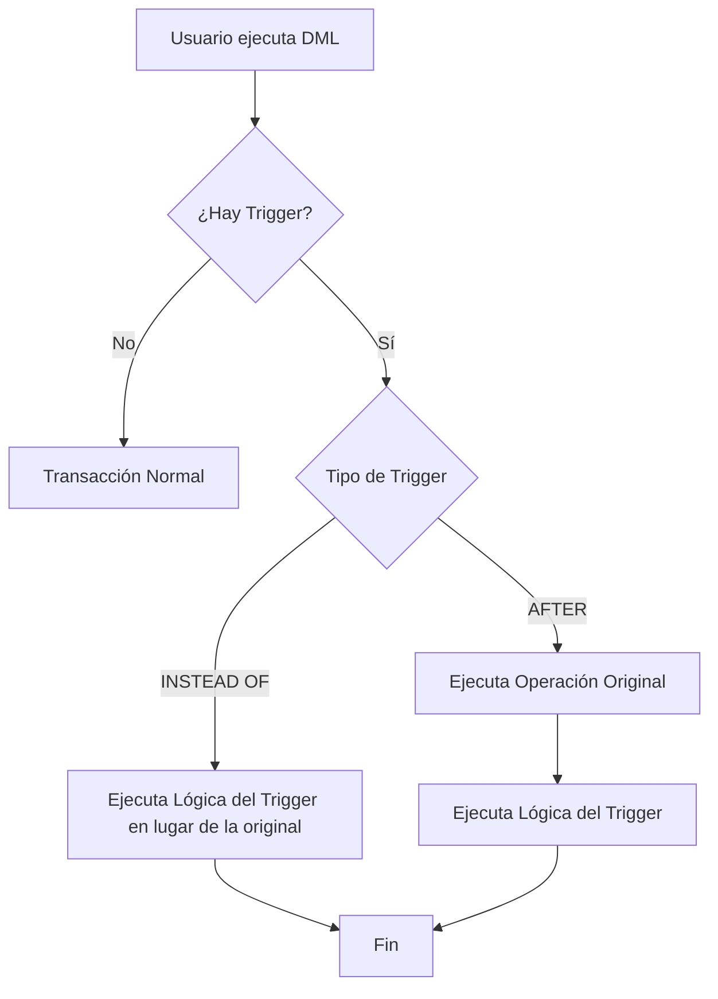

# Triggers: Desencadenadores de Base de Datos ⚡

Un **Trigger** es un objeto de la base de datos que se ejecuta (se "dispara") de forma automática en respuesta a un evento específico (INSERT, UPDATE o DELETE) en una tabla o vista.

---

## 1. Componentes de un Trigger

Para que un trigger funcione correctamente, debe definirse bajo tres pilares:
1.  **Nombre:** Identificador único dentro del esquema.
2.  **Evento Activador:** La acción transaccional que lo despierta (`INSERT`, `UPDATE`, `DELETE`).
3.  **Cuerpo/Lógica:** El bloque de código SQL que realiza la tarea deseada.

---

## 2. Ciclo de Vida del Trigger



---

## 3. Tipos de Triggers

### A. Triggers AFTER (Después)
Se ejecutan **después** de que la operación DML se ha realizado y validado con éxito.
-   **Uso común:** Auditoría (registrar quién cambió qué), sincronización de tablas, actualización de totales acumulados.
-   *Ejemplo:* Al insertar una venta, un trigger AFTER puede restar automáticamente el stock del producto.

### B. Triggers INSTEAD OF (En lugar de)
Se ejecutan **en lugar de** la instrucción que los activó. Interceptan la petición original.
-   **Uso común:** Validaciones complejas, permitir inserciones en vistas no actualizables.
-   *Ejemplo:* Si alguien intenta borrar un cliente importante, el trigger puede cancelar la acción y guardar un log de advertencia.

---

## 4. El Secreto: Tablas Especiales `inserted` y `deleted`

Cuando un trigger se dispara, el motor de base de datos crea dos tablas temporales en memoria para que podamos comparar datos:

| Operación | Tabla `inserted` | Tabla `deleted` |
| :--- | :--- | :--- |
| **INSERT** | Contiene los **nuevos** registros. | Vacía. |
| **UPDATE** | Contiene los datos **después** del cambio. | Contiene los datos **antes** del cambio. |
| **DELETE** | Vacía. | Contiene los registros **eliminados**. |

---

## 5. Estructura de Creación (Ejemplo)

```sql
CREATE TRIGGER TR_Auditoria_Precios
ON Productos
AFTER UPDATE
AS
BEGIN
    INSERT INTO Log_Precios (ID_Producto, Precio_Viejo, Precio_Nuevo, Fecha)
    SELECT d.ID, d.Precio, i.Precio, GETDATE()
    FROM deleted d
    JOIN inserted i ON d.ID = i.ID
    WHERE d.Precio <> i.Precio -- Solo si el precio realmente cambió
END;
```

---

## 6. Consideraciones y Buenas Prácticas

> [!warning] Impacto en el Rendimiento
> Los triggers se ejecutan dentro de la misma transacción que los activó. Si un trigger es lento o hace cálculos pesados, **bloqueará** la tabla y hará que toda la aplicación se sienta lenta.

-   **Evitar la Recursividad:** Un trigger que actualiza su propia tabla puede dispararse a sí mismo infinitamente. Configura la base de datos para evitar "Nested Triggers" si es necesario.
-   **Mantenlo Simple:** La lógica compleja debe ir en Procedimientos Almacenados (Store Procedures), no en triggers.
-   **Documentación Extrema:** Dado que los triggers son "invisibles" (no se ven en el código de la App), es vital documentarlos para que otros desarrolladores entiendan por qué los datos cambian "solos".
-   **Procesamiento por Lotes:** Recuerda que un trigger se dispara **una vez por sentencia**, no por fila. Tu código debe ser capaz de manejar actualizaciones masivas de miles de filas a la vez.
