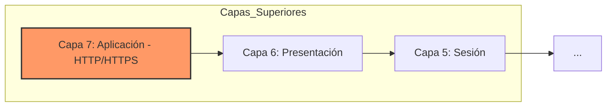
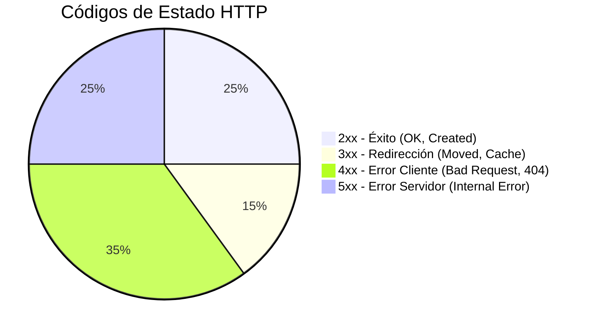
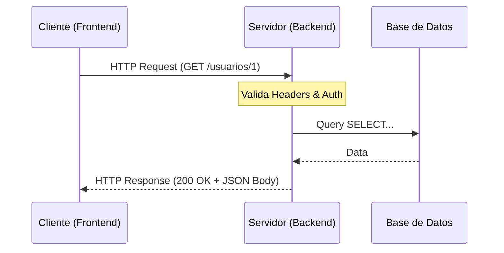

# Arquitectura de APIs REST y Protocolo HTTP

En el desarrollo de software moderno, la comunicación entre aplicaciones se basa mayoritariamente en el estilo arquitectónico **REST (Representational State Transfer)** sobre el protocolo **HTTP**.

---

## 1. Arquitectura de Red y Protocolos

### El Modelo OSI y HTTP

HTTP opera en la **Capa 7 (Aplicación)** del modelo OSI. Se define como un protocolo **stateless** (sin estado), lo que significa que cada petición es independiente y no guarda relación con la anterior.

### HTTP vs. HTTPS

- **HTTP:** Maneja la semántica de la comunicación (métodos, cabeceras, rutas).
- **HTTPS:** Es HTTP viajando sobre una capa de seguridad **TLS/SSL**, cifrando los datos para evitar intercepciones.

---

## 2. Diseño de APIs RESTful y Semántica

REST mapea las operaciones de negocio a verbos estandarizados de HTTP.

### Operaciones CRUD
| Acción DB  | Verbo HTTP      | Descripción                         |
| :--------- | :-------------- | :---------------------------------- |
| **C**reate | `POST`          | Crea un nuevo recurso.              |
| **R**ead   | `GET`           | Recupera información de un recurso. |
| **U**pdate | `PUT` / `PATCH` | Actualiza un recurso existente.     |
| **D**elete | `DELETE`        | Elimina un recurso.                 |

### Propiedades de Diseño

> [!important] Idempotencia
> Una operación es **idempotente** si realizarla varias veces produce el mismo resultado que realizarla una sola vez.
> - **Idempotentes:** `GET`, `PUT`, `DELETE`.
> - **No Idempotente:** `POST` (crearía múltiples registros).

> [!check] Seguridad
> Un método es **seguro** si es de solo lectura y no altera el estado del servidor.
> - **Seguro:** `GET`, `HEAD`, `OPTIONS`.

---

## 3. Estructura Interna de la Petición (Request)

Cuando un cliente (browser, app móvil) envía una petición, esta tiene una estructura definida:

1.  **Línea de Petición:** `MÉTODO` + `URI` + `VERSIÓN` (ej. `GET /api/usuarios v1.1`).
2.  **Headers (Metadatos):**
    *   `Host`: Dominio del servidor.
    *   `Authorization`: Tokens de acceso (Bearer JWT).
    *   `Accept`: Formato que el cliente espera recibir (`application/json`).
3.  **Body (Payload):** Contiene los datos en formato JSON/XML.
    *   *Nota:* Los métodos `GET` **no deben** llevar cuerpo; usan *Query Strings* en la URL.

---

## 4. Estructura Interna de la Respuesta (Response)

El servidor procesa la petición y devuelve:

1.  **Línea de Estado:** `VERSIÓN` + `CÓDIGO` + `MENSAJE` (ej. `HTTP/1.1 200 OK`).
2.  **Headers:** `Content-Type`, `Set-Cookie`, `Cache-Control`.
3.  **Body:** Los datos solicitados o el detalle del error.

### Categorización de Códigos de Estado

> [!abstract] Resumen de Códigos Comunes
> - **200 OK:** Petición exitosa.
> - **201 Created:** Recurso creado con éxito (típico de POST).
> - **304 Not Modified:** Usado para optimizar caché.
> - **400 Bad Request:** Error de sintaxis o validación del cliente.
> - **401 Unauthorized:** Falta autenticación.
> - **404 Not Found:** El recurso no existe.
> - **500 Internal Server Error:** El código del backend falló.

---

## 5. Flujo de Comunicación (Diagrama)

---

## 6. Formatos de Intercambio (Content-Type)

El encabezado `Content-Type` es vital para que ambas partes entiendan los datos:
- `application/json`: El estándar moderno.
- `text/html`: Para páginas web tradicionales.
- `multipart/form-data`: Para subir archivos e imágenes.
