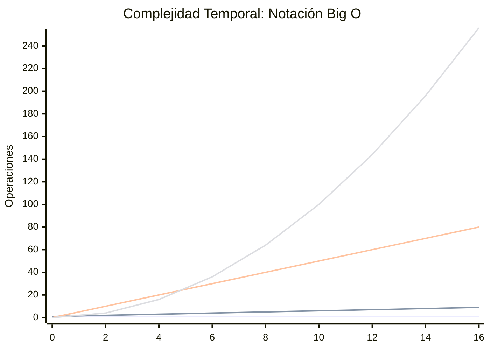
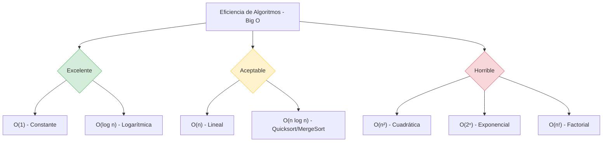

Relacionado: [[Programacion-Estructurada]]


# Algoritmos de Ordenamiento

> [!info] Entender estos algoritmos es fundamental para el desarrollo de software, ya que te permiten optimizar el rendimiento y la eficiencia de tus programas. 

---
## Merge Sort (Ordenamiento por Mezcla)

> [!summary] Como funciona?

> Es un algoritmo basado en el paradigma de **"divide y vencerás"**. Divide la lista de elementos por la mitad repetidamente hasta que cada sublista tiene un solo elemento (una lista de un elemento ya está ordenada). Luego, "mezcla" (merges) estas sublistas de nuevo en orden, creando listas ordenadas cada vez más grandes hasta reconstruir la lista completa.

### Complejidad

- `Tiempo:` O(nlogn) en el mejor, promedio y peor de los casos.
- `Espacio:` O(n) porque requiere memoria adicional para crear los arreglos temporales durante la mezcla.

### Aplicaciones en Software

- `Bases de Datos y Ordenamiento Externo:` Es excelente cuando el conjunto de datos es demasiado grande para caber en la memoria RAM y debe leerse desde el disco duro (external sorting).
- `Lenguajes de Programacion:` Muchos lenguajes lo usan (o variaciones como Timsort) para sus funciones de ordenamiento nativas porque es un algoritmo _estable_ (mantiene el orden relativo de elementos con el mismo valor).

## `Codigo`

``` c#
public class MergeSortAlgorithm
{
    public static void MergeSort(int[] arr, int left, int right)
    {
        if (left < right)
        {
            int mid = left + (right - left) / 2;
            
            // Ordena la primera y segunda mitad
            MergeSort(arr, left, mid);
            MergeSort(arr, mid + 1, right);
            
            // Une las mitades ordenadas
            Merge(arr, left, mid, right);
        }
    }

    private static void Merge(int[] arr, int left, int mid, int right)
    {
        int n1 = mid - left + 1;
        int n2 = right - mid;

        int[] L = new int[n1];
        int[] R = new int[n2];

        // Copia los datos a los arreglos temporales
        for (int x = 0; x < n1; ++x) L[x] = arr[left + x];
        for (int y = 0; y < n2; ++y) R[y] = arr[mid + 1 + y];

        int i = 0, j = 0, k = left;
        
        // Mezcla los arreglos temporales de vuelta al original
        while (i < n1 && j < n2)
        {
            if (L[i] <= R[j])
            {
                arr[k] = L[i];
                i++;
            }
            else
            {
                arr[k] = R[j];
                j++;
            }
            k++;
        }

        // Copia los elementos restantes si los hay
        while (i < n1)
        {
            arr[k] = L[i];
            i++; k++;
        }
        while (j < n2)
        {
            arr[k] = R[j];
            j++; k++;
        }
    }
}
```

---

## Quick Sort (Ordenamiento Rapido)

> [!summary] Como funciona?

>También usa "divide y vencerás". Elige un elemento de la lista llamado **pivote**. Luego, reorganiza la lista de manera que todos los elementos menores que el pivote queden a su izquierda, y los mayores a su derecha. Finalmente, aplica este mismo proceso de forma recursiva a las sublistas de la izquierda y la derecha.

### Complejidad

- `Tiempo:` O(nlogn) en el caso promedio. En el peor de los casos (si el pivote elegido es siempre el extremo) cae a O(n2), pero con buenas técnicas para elegir el pivote, esto es raro.
- `Espacio:` O(logn) debido a las llamadas en la pila de recursividad.

### Aplicaciones de Software

- `Sistemas y librerias estandar:` Es el algoritmo de ordenamiento por defecto en muchas librerías estándar (como la función `qsort` en C o el ordenamiento de tipos primitivos en Java) porque, en la práctica, sus constantes ocultas son muy pequeñas y es extremadamente amigable con la memoria caché del procesador.

## `Codigo`

```c#
public class QuickSortAlgorithm
{
    public static void QuickSort(int[] arr, int low, int high)
    {
        if (low < high)
        {
            int pi = Partition(arr, low, high);

            // Ordena recursivamente los elementos antes y después de la partición
            QuickSort(arr, low, pi - 1);
            QuickSort(arr, pi + 1, high);
        }
    }

    private static int Partition(int[] arr, int low, int high)
    {
        int pivot = arr[high]; // Elegimos el último elemento como pivote
        int i = (low - 1); // Índice del elemento más pequeño

        for (int j = low; j < high; j++)
        {
            if (arr[j] <= pivot)
            {
                i++;
                // Intercambia arr[i] y arr[j]
                int temp = arr[i];
                arr[i] = arr[j];
                arr[j] = temp;
            }
        }

        // Intercambia arr[i+1] y el pivote (arr[high])
        int temp1 = arr[i + 1];
        arr[i + 1] = arr[high];
        arr[high] = temp1;

        return i + 1;
    }
}
```

---

## Heap Sort (Ordenamiento por Monticulos)

> [!summary] Como funciona?

> Convierte el arreglo en una estructura de datos de árbol binario llamada **Max-Heap** (donde el nodo padre siempre es mayor que sus hijos). Una vez construido el árbol, el elemento más grande queda en la raíz (la primera posición del arreglo). El algoritmo intercambia esta raíz con el último elemento, reduce el tamaño del Heap en uno, y vuelve a balancear el árbol. Repite esto hasta que todos los elementos estén ordenados.

### Complejidad

- `Tiempo:` O(nlogn) en el mejor, promedio y peor de los casos.
- `Espacio:` O(1) porque ordena los elementos en el mismo arreglo (in-place), sin requerir memoria extra. 

### Aplicaciones de Software

- `Sistemas embebidos y de tiempo real:` Como no usa memoria adicional y su tiempo de ejecución está garantizado en O(nlogn), es ideal para sistemas con recursos muy limitados (como el kernel de Linux) donde un fallo por falta de memoria o un pico de lentitud repentino (como el peor caso de Quick Sort) sería catastrófico.

## `Codigo`

``` c#
public class HeapSortAlgorithm
{
    public static void HeapSort(int[] arr)
    {
        int n = arr.Length;

        // Construye el Max-Heap
        for (int i = n / 2 - 1; i >= 0; i--)
        {
            Heapify(arr, n, i);
        }

        // Extrae elementos del Heap uno por uno
        for (int i = n - 1; i > 0; i--)
        {
            // Mueve la raíz actual al final
            int temp = arr[0];
            arr[0] = arr[i];
            arr[i] = temp;

            // Llama a max heapify en el heap reducido
            Heapify(arr, i, 0);
        }
    }

    private static void Heapify(int[] arr, int n, int i)
    {
        int largest = i; // Inicializa el más grande como la raíz
        int left = 2 * i + 1; 
        int right = 2 * i + 2; 

        // Si el hijo izquierdo es mayor que la raíz
        if (left < n && arr[left] > arr[largest])
        {
            largest = left;
        }

        // Si el hijo derecho es mayor que el más grande hasta ahora
        if (right < n && arr[right] > arr[largest])
        {
            largest = right;
        }

        // Si el más grande no es la raíz, intercambia y continúa
        if (largest != i)
        {
            int swap = arr[i];
            arr[i] = arr[largest];
            arr[largest] = swap;

            Heapify(arr, n, largest);
        }
    }
}
```

---

## Binary Search (Busqueda Binaria)

> [!summary] Como funciona?

> A diferencia de los anteriores, este es un algoritmo de **búsqueda**, no de ordenamiento. **Requiere que la lista esté previamente ordenada**. Funciona comparando el valor que buscas con el elemento en el medio del arreglo. Si el valor es menor, descarta la mitad derecha y repite la búsqueda en la mitad izquierda. Si es mayor, busca en la derecha. Descarta la mitad de las opciones en cada paso.

### Complejidad

- `tiempo:` O(logn), lo cual es increíblemente rápido. (Buscar en una lista de mil millones de elementos toma como máximo ~30 pasos).
- `Espacio:` O(1) si se implementa de forma iterativa.

### Aplicaciones de Software

- `Busqueda de Base de Datos:` Para encontrar registros rápidamente usando índices.
- `Depuracion de Codigo:` Herramientas como `git bisect` usan búsqueda binaria en el historial de commits para encontrar exactamente en qué momento se introdujo un bug en el código.

## `Codigo`

``` c#
public class BinarySearchAlgorithm
{
    public static int BinarySearch(int[] arr, int target)
    {
        int left = 0, right = arr.Length - 1;

        while (left <= right)
        {
            int mid = left + (right - left) / 2;

            // Verifica si el objetivo está en el medio
            if (arr[mid] == target)
            {
                return mid; // Retorna el índice del elemento
            }

            // Si el objetivo es mayor, ignora la mitad izquierda
            if (arr[mid] < target)
            {
                left = mid + 1;
            } 
            // Si el objetivo es menor, ignora la mitad derecha
            else
            {
                right = mid - 1;
            }
        }

        return -1; // Retorna -1 si el elemento no está en el arreglo
    }
}
```

---

## Bubble Sort (Ordenamiento Burbuja)

> [!summary] Como funciona?

> Es el algoritmo más sencillo. Recorre la lista comparando cada par de elementos adyacentes. Si están en el orden equivocado (el primero es mayor que el segundo), los intercambia. Repite este recorrido por toda la lista hasta que no se necesiten más intercambios, "burbujeando" los valores más grandes hacia el final del arreglo paso a paso.

### Complejidad

- `Educacion:` Raramente se usa en software real debido a su ineficiencia con conjuntos de datos medianos o grandes. Su principal utilidad es académica, para enseñar los conceptos básicos de algoritmos e iteraciones a estudiantes de programación.
- `Casos de Nichos Extremos:` - A veces se usa en sistemas computacionales muy antiguos o en listas extremadamente pequeñas que ya están casi ordenadas, debido a la simplicidad de su código.

## `Codigo`

``` c#
public class BubbleSortAlgorithm
{
    public static void BubbleSort(int[] arr)
    {
        int n = arr.Length;
        bool swapped;
        
        for (int i = 0; i < n - 1; i++)
        {
            swapped = false;
            for (int j = 0; j < n - i - 1; j++)
            {
                if (arr[j] > arr[j + 1])
                {
                    // Intercambia los elementos
                    int temp = arr[j];
                    arr[j] = arr[j + 1];
                    arr[j + 1] = temp;
                    swapped = true;
                }
            }
            // Si no hubo intercambios en este bucle interno, la lista ya está ordenada
            if (!swapped)
            {
                break;
            }
        }
    }
}
```

---

# `Resumen de Complejidad Comparativa

| **Algoritmo**     | **Tiempo Promedio** | **Peor Tiempo** | **Memoria (Espacio)** | **¿Es estable?** |
| ----------------- | ------------------- | --------------- | --------------------- | ---------------- |
| **Merge Sort**    | $O(n \log n)$       | $O(n \log n)$   | $O(n)$                | Sí               |
| **Quick Sort**    | $O(n \log n)$       | $O(n^2)$        | $O(\log n)$           | No               |
| **Heap Sort**     | $O(n \log n)$       | $O(n \log n)$   | $O(1)$                | No               |
| **Bubble Sort**   | $O(n^2)$            | $O(n^2)$        | $O(1)$                | Sí               |
| **Binary Search** | $O(\log n)$         | $O(\log n)$     | $O(1)$                | N/A              |

---

## Explicacion de La Notacion Big O (O)

> Es la forma Estandar de medir la complejidad. Imagina que tienes una lista de n elementos:

- **O(1) - Tiempo Constante:** El algoritmo tarda lo mismo sin importar si tienes 10 datos o 10 millones.

 >[!example] Ejemplo: Acceder al primer elemento de un array.

- **O(n) - Tiempo Lineal:** El tiempo crece proporcionalmente a los datos.

>[!example] _Ejemplo:_ Buscar un nombre en una lista desordenada (tienes que leer uno por uno).

- **O(n2) - Tiempo Cuadrático:** El tiempo se dispara. Si doblas los datos, el tiempo se cuadruplica.

>[!example] _Ejemplo:_ Dos bucles `for` anidados (común en ordenamientos básicos como el de burbuja).

- **O(logn) - Tiempo Logarítmico:** Es el "santo grial" de las búsquedas. A medida que los datos crecen, el tiempo aumenta muy poco.

>[!example] _Ejemplo:_ Búsqueda binaria.


## Overview

>[!success] Esta imagen es un gráfico que ilustra el concepto de la Notación O Grande. Representa visualmente cuánto tiempo o espacio le tomaría a una función o algoritmo completar una tarea determinada. En otras palabras, nos ayuda a comprender mejor la complejidad de un algoritmo y su eficiencia a medida que aumenta el número de elementos que debe procesar.

## O

>[!success] The vertical axis of this chart is represented by the letter O, which represents the output of the algorithm. It measures the number of operations or the time complexity of an algorithm. A smaller value on this axis represents better efficiency and is more desirable.

## N

>[!success] El eje horizontal de este gráfico está representado por la letra N. Representa el número de elementos del conjunto de datos sobre los que el algoritmo realiza sus operaciones. Por ejemplo, podría tratarse de una matriz de 10 elementos que se buscan para un elemento específico.

## O(1)

>[!success] En la parte inferior del gráfico, vemos la notación O(1), que representa la complejidad de tiempo constante. El tiempo que tarda este algoritmo no aumenta con el número de elementos en el conjunto de datos. Un ejemplo de una función O(1) es acceder a un elemento de una matriz por su índice.

## O(log N)

>[!success] La siguiente notación, O(log N), se denomina complejidad temporal logarítmica. A medida que aumenta el número de elementos en la entrada, el número de operaciones crece logarítmicamente. El ejemplo más común de este tipo de función es la búsqueda binaria.

## O(N)

>[!success] Al ascender en el gráfico, O(N) se conoce como complejidad temporal lineal. Esto significa que el algoritmo crece linealmente con el número de elementos en el conjunto de datos. A medida que el número de elementos se duplica, también lo hace el tiempo que tarda en completarse la función. Buscar un elemento en una matriz sin ordenar es un ejemplo de una función de complejidad temporal lineal.

## O N(log N)

>[!success] La siguiente notación en nuestro gráfico es O(N log N), o tiempo lineal-ítmico. La complejidad temporal de dicha función es directamente proporcional al número de elementos multiplicado por el logaritmo del número de elementos. Los algoritmos de ordenamiento más eficientes, como el ordenamiento por fusión o el ordenamiento rápido, tienen una complejidad temporal promedio de O(N log N).

## O(N^3)

>[!success] Subiendo, vemos la notación O(N^3), que representa la complejidad temporal cúbica. A medida que aumenta el número de elementos, el tiempo que tarda el algoritmo en completar su tarea crece de forma cúbica. Un ejemplo de un algoritmo con esta complejidad temporal es cuando buscamos tres números en un conjunto que suman cero.

## O(2^N)

>[!success] La notación O(2^N) representa una complejidad temporal exponencial. Esto significa que, a medida que aumenta el número de elementos, la complejidad temporal se duplica con cada elemento añadido. Un ejemplo de este algoritmo es calcular el n-ésimo número de Fibonacci mediante un enfoque recursivo sin memorización.

## O(N!)

>[!success] La notación más alta en este gráfico es O(N!). Esto representa una complejidad temporal factorial. El algoritmo requiere N! operaciones para completarse, donde N es el tamaño del conjunto de datos. A menudo se considera uno de los peores escenarios en términos de rendimiento. Un ejemplo de un algoritmo con esta complejidad temporal es la solución del problema del viajante mediante fuerza bruta.


![[Pasted image 20260220161212.png]]

---



|**Línea**|**Complejidad**|**Color (Aprox)**|**Significado**|
|---|---|---|---|
|1|**$O(1)$**|Azul claro|Constante (Acceso directo)|
|2|**$O(\log n)$**|Verde|Logarítmica (Búsqueda Binaria)|
|3|**$O(n)$**|Amarillo|Lineal (Bucle simple)|
|4|**$O(n^2)$**|Rojo|Cuadrática (Bucles anidados)|





