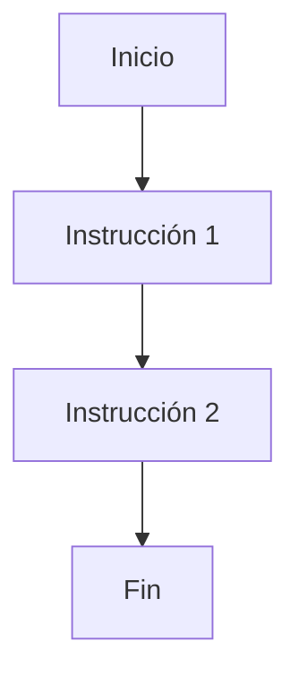

# Programación Estructurada

> [!info] Paradigma de programación orientado a mejorar la claridad, calidad y tiempo de desarrollo utilizando únicamente subrutinas y tres estructuras de control.

## Los 3 Pilares

### 1. Secuencia
> [!summary] Las instrucciones se ejecutan una tras otra en el orden en que están escritas.

### 2. Selección (Decisión)
> [!summary] Ejecución condicional de bloques de código.

-   **Simple**: `if`
-   **Doble**: `if-else`
-   **Múltiple**: `switch`

### 3. Iteración (Bucles)
> [!summary] Ejecución repetida de un bloque de código mientras se cumpla una condición.

-   **While**: Evalúa la condición antes (puede no ejecutarse nunca).
-   **Do-While**: Evalúa al final (se ejecuta al menos una vez).
-   **For**: Iteración controlada por contador.

---

## Modularidad

> [!important] Dividir un programa grande en subprogramas (funciones o procedimientos) más pequeños y manejables.

### Ventajas
1.  **Reutilización de código**: Escribir una vez, usar muchas.
2.  **Facilidad de mantenimiento**: Cambios localizados.
3.  **Abstracción**: Ocultar detalles de implementación.
4.  **Colaboración**: Múltiples programadores pueden trabajar en módulos distintos.
