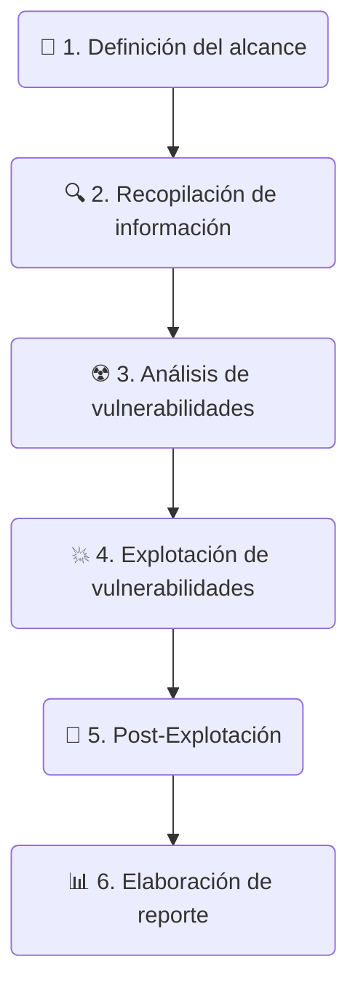

[[securing-your-it-infrastructure-against-today-s-and-tomorrow-s-computers-and-criminals]]

# 🛡️ Metodologías de Hacking Ético

## 🎯 Importancia de las metodologías

> [!info] **Concepto Principal**
> Las metodologías nos facilitan la realización de un conjunto de actividades en un orden determinado y estableciendo una prioridad adecuada para intentar garantizar el éxito y alcanzar un objetivo final.

---

## 📚 Metodologías Principales

- 📘 **OSSTMM (Open-Source Security Testing Methodology Manual)**
  - *La más popular*
  - 🔗 [PDF Oficial](https://www.isecom.org/OSSTMM.3.pdf)

- 📙 **PTES (Penetration Testing Execution Standard)**
  - 🔗 [Página Principal](http://www.pentest-standard.org/index.php/Main_Page)

- 📗 **ISSAF (Information Systems Security Assessment Framework)**
  - 🔗 [Descarga Oficial](https://sourceforge.net/projects/isstf/files/issaf%20document/issaf0.2.1/)

- 📕 **OWASP Testing Project (Web Security Testing Guide)**
  - 🔗 [Proyecto OWASP](https://owasp.org/www-project-web-security-testing-guide/)

---

## 🧭 Mi Metodología (Flujo de Trabajo)

- 📝 **1.** Definición del alcance del test de penetración.
- 🔍 **2.** Recopilación de información.
- ☢️ **3.** Identificación y análisis de vulnerabilidades.
- 💥 **4.** Explotación de vulnerabilidades.
- 🔑 **5.** Post-Explotación.
- 📊 **6.** Elaboración de un documento de reporte.

---

## 📋 Definición de Alcance del Hacking Ético

> [!warning] **Acciones Previas Críticas**

- 🗣️ **Discutir con el Cliente las Tareas:** Antes de realizar ninguna acción, discutir las tareas que llevará a cabo el analista durante el hacking ético, así como los roles y responsabilidades de ambos.
- ✍️ **Asegurar mediante contrato firmado:** Garantizar que las acciones que se llevan a cabo son en representación del cliente.
- 📜 **Análisis de la política de la organización:** Entender las políticas que definen el uso que los usuarios hacen de los sistemas y de la infraestructura.
- 🚨 **Plan de contingencia:** Establecer el procedimiento en el caso de que se localice una intrusión por un tercero.

---

## 📈 Ejemplos de Informes de Hacking Ético y Auditoría de Seguridad

> [!question] **¿Cómo es un informe real de Hacking Ético o Auditoría de Seguridad?**
>
> Antes de nada, debéis tener en cuenta que los informes de Hacking ético y auditoría de seguridad dependen mucho de la organización que los realiza y del tipo de auditoría que se ha llevado a cabo.
>
> No todas las auditorías son completas y siguen todas las fases que se enseñan en este curso, en algunas ocasiones se centran en fases o entornos específicos dentro de la infraestructura tecnológica de una organización. Todo esto se debe concretar en la fase de definición del alcance que se mencionaba en la sección anterior.

### 🗃️ Repositorio de Auditorías Reales

> [!example] El primer recurso que me gustaría compartiros es un **repositorio donde podéis encontrar cientos de reportes de auditorías reales** de diferentes empresas del sector del Hacking Ético y de la Ciberseguridad que se han ido recopilando a lo largo del tiempo. Tenéis informes de todo tipo y que recogen una diversidad muy grande de auditorías.
- 🔗 [public-pentesting-reports (GitHub)](https://github.com/juliocesarfort/public-pentesting-reports)

### 📄 Plantillas para Informes

> [!example] El segundo recurso que quiero compartiros se corresponde con diferentes **plantillas que podéis utilizar para comenzar a elaborar vuestro propio informe** de Hacking Ético o auditoría de seguridad e ir modificándolo para que se adapte a vuestras necesidades.
- 🔗 [pentestreports.com/templates/](https://pentestreports.com/templates/)
- 🔗 [TCM-Security-Sample-Pentest-Report (GitHub)](https://github.com/hmaverickadams/TCM-Security-Sample-Pentest-Report)

