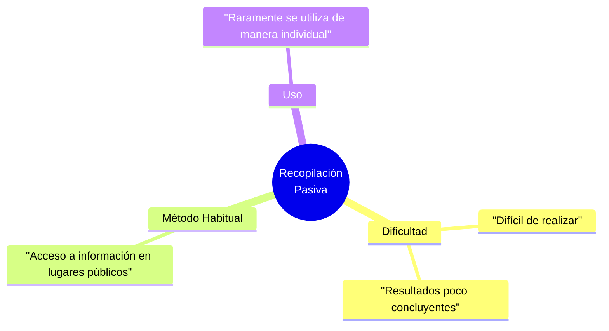

# 🕵️‍♂️ Recopilación Pasiva de Información

> [!info] **Concepto Principal**
> Recolección de información sobre un objetivo determinado sin que las actividades realizadas por el analista sean mínimamente detectadas por dicho objetivo.

---

## 📊 Características Principales



- 🧩 **Dificultad:** Difícil de realizar y a menudo proporciona resultados poco concluyentes.
- 🌐 **Método Habitual:** La manera habitual de recolección pasiva de información es mediante el acceso a la información almacenada en lugares públicos.
- 🔗 **Frecuencia de Uso:** Raramente se utiliza de manera individual.

---

## 🔍 Hacking de Buscadores: Google Hacking

> [!abstract] El **Google Hacking** se utiliza para encontrar información sensible expuesta buscando patrones específicos en los buscadores.

### 📑 Operadores Básicos y Filtrado

> [!tip] **Fuerza que todos los resultados pertenezcan a la URL específica**
```text
site:page.com objetivo tipo_archivo
```

> [!tip] **Reduce el espacio de búsqueda (ej. que el resultado sea un PDF)**
```text
site:page.com filetype:pdf
```

### 🔀 Operaciones Booleanas y Archivos Expuestos

> [!example] **Operaciones Booleanas** (útil para encontrar directorios abiertos o registros)
```text
"index of" / "chat/logs"
```

### 🗄️ Búsqueda de Bases de Datos (SQL)

> [!warning] **Información SQL expuesta** (Buscando volcados de bases de datos)
```text
filetype:SQL "MySQL dump"
```

> [!warning] **Que busque palabras clave sensibles en el texto SQL** (como contraseñas)
```text
filetype:SQL "MySQL dump" (pass|password|passwd|pwd)
```

### 🌐 Aplicaciones Web y Sitios Específicos

> [!example] **App Web con URL específica (buscar una parte de la URL)**
```text
inurl:index.php?id=
```

> [!example] **Más Sites** (Ej. Búsqueda en sitios del gobierno de documentos restringidos)
```text
site:gov filetype:pdf allintitle:restricted
```
