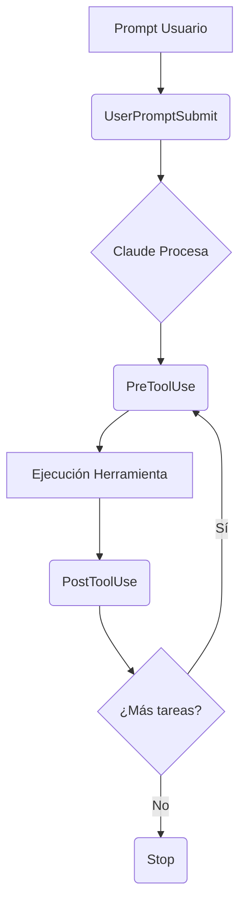

# ⚓ Hooks Avanzados y Ciclo de Vida

> [!info] Más allá de Pre/Post Tool Use
> Aunque los hooks de herramientas son los más comunes, Claude Code ofrece un ecosistema completo de eventos que permiten monitorear casi cualquier acción dentro de la sesión.

---

## 🗓️ Eventos del Ciclo de Vida

Existen hooks específicos para cada fase de la interacción. Aquí tienes el desglose de los eventos adicionales:

| Hook | Momento de Ejecución |
| :--- | :--- |
| **Notification** | Cuando Claude pide permiso para una herramienta o tras 60s de inactividad. |
| **Stop** | Cuando Claude termina de responder por completo. |
| **SubagentStop** | Cuando un subagente (una "Tarea" en la UI) ha finalizado. |
| **PreCompact** | Antes de una operación de compactación (manual o automática). |
| **UserPromptSubmit** | Inmediatamente después de que el usuario envía un prompt, antes del proceso de IA. |
| **SessionStart** | Al iniciar o reanudar una sesión de Claude Code. |
| **SessionEnd** | Al cerrar la sesión actual. |

---

## ⚠️ El "Lado Confuso": Variabilidad del Input

> [!warning] Estructura Dinámica de `stdin`
> Un error común es asumir que todos los hooks reciben los mismos datos. La entrada `stdin` cambia drásticamente según:
> 1. El **Tipo de Hook** (Stop vs PreToolUse).
> 2. La **Herramienta** llamada (Read vs TodoWrite).

### Comparativa de Estructuras JSON

#### 1. Ejemplo: PostToolUse (Observando `TodoWrite`)
```json
{
  "session_id": "9ecf22fa-edf8...",
  "hook_event_name": "PostToolUse",
  "tool_name": "TodoWrite",
  "tool_input": {
    "todos": [{ "content": "write a readme", "status": "pending" }]
  },
  "tool_response": {
    "oldTodos": [],
    "newTodos": [{ "content": "write a readme", "status": "pending" }]
  }
}
```

#### 2. Ejemplo: Hook de parada (Stop)
```json
{
  "session_id": "af9f50b6-f042...",
  "hook_event_name": "Stop",
  "stop_hook_active": false
}
```

---

## 🛠️ Estrategia Pro: El Hook de "Inspección"

Debido a que es difícil predecir la estructura exacta de los datos para hooks complejos, la mejor práctica es crear un **Hook de Ayuda** para debuguear:

> [!tip] Hack de Debugging: Logger de Hooks
> Añade temporalmente este hook a tu configuración para capturar y analizar qué datos recibe realmente tu comando.

```json
"PostToolUse": [ 
  {
    "matcher": "*",
    "hooks": [
      {
        "type": "command",
        "command": "jq . > post-log.json"
      }
    ]
  }
]
```

### ¿Por qué funciona?
- **Matcher `*`**: Captura absolutamente todas las herramientas.
- **`jq . > post-log.json`**: Vuelca el JSON de entrada directamente a un archivo para que puedas inspeccionarlo con calma y diseñar tu lógica de automatización basándote en datos reales.

---

## 🔄 Resumen de Flujo de Datos



---
**Volver a:** [[Claude-Code]]
