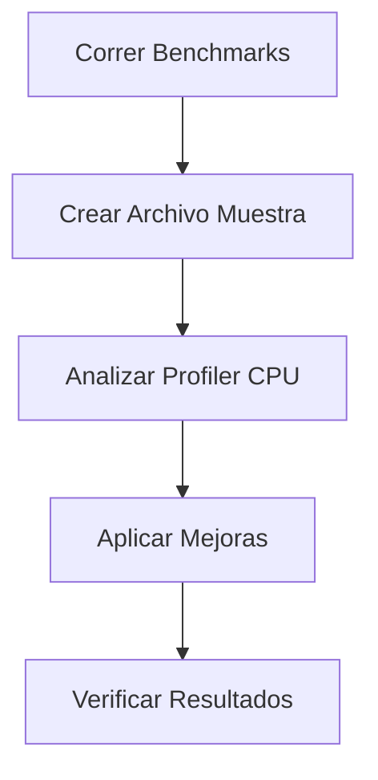
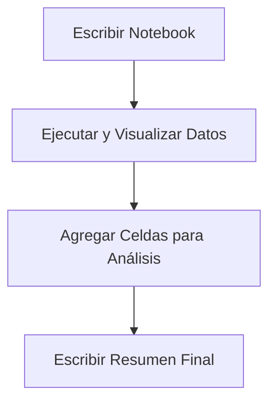
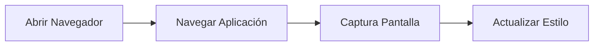
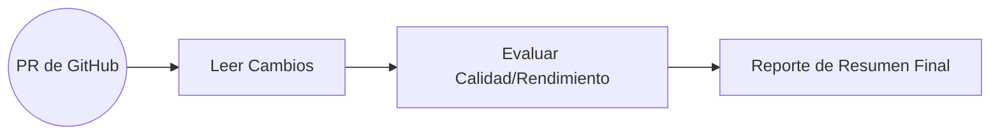

2# 🛠️ Herramientas en Claude Code

![[Pasted image 20260305115011.png]]

---

## ⚡ Tarea de Optimizacion

### 🔄 Flujo de Trabajo

- 🔹 `Tarea(Izquierda):` Ejecutar pruebas de rendimiento (Benchmarks) para la libreria Chalk. Para cualquier resultado que parezca lento, encontrar la causa raiz y solucionarlo.
- 🔹 `Centro:` Codigo de Claude(Claude Code)

### 📝 Pasos a Seguir

1. **Ejecutar pruebas de Rendimiento:** Correr Benchmarks iniciales.
2. **Escribir un archivo de muestra:** Crear un Archivo para explorar el peor de los casos (worst case).
3. **Usar un Perfilador de CPU:** Utilizar la CPU profiler y analizar resultados.
4. **Implementar mejoras:** Aplicar los cambios necesarios para optimizar el código.
5. **Verificar mejoras:** Comprobar que los cambios realmente funcionaron.



```shell
npm install chalk
```

![[Pasted image 20260305115719.png]]

---

## 📊 Data Analysis Task

> [!abstract] Encontrar informacion relevante(insights) utilizando datos sobre usuarios de una plataforma de streaming de video.

### 📈 Flujo de analisis de Datos

- 🔹 `Tarea(izquierda):` Realizar un analisis sobre los datos en el archivo `Streaming.csv`
- 🔹 `Centro:` Codigo de Claude(Claude Code)

### 📝 Pasos a Seguir

- **Escribir código en un cuaderno (Notebook):** Para examinar el formato de datos.
- **Ejecutar el código y examinar los resultados:** Para ver los hallazgos iniciales.
- **Agregar Celdas:** Ejecutando cada una para guiar el análisis.
- **Escribir un resumen final:** Para concluir el estudio.



![[Pasted image 20260305130705.png]]

---

## 🎨 Tarea de Estilizado de Interfaz (UI Styling Task)

> [!summary] **Objetivo:** Mejorar el diseno de una aplicacion, enfocandose en la interfaz de chat y el encabezado

- 🔹 `Herramienta(Playwright MCP Server):` Conjunto de herramientas que permiten a Claude controlar el navegador:

### 🚶 Pasos De Claude Code

- Abrir el Navegador
- Navegar hacia la aplicación
- Tomar una captura de pantalla (screenshot)
- Actualizar el estilo visual



![[Pasted image 20260305132223.png]]

---

## 🐙 Integracion con Github

### 📥 Entradas (Izquierda)

- 🔹 `Tarea:` Revisar los cambios en la solicitud de extraccion (pull request)
- 🔹 `Servidor MCP de Github:` Conjunto de herramientas que permiten a Claude interactuar con Github

### 🧠 Proceso Central

- 🔹 Claude Code(El nucleo de procesamiento de IA)

### 📤 Salidas/Acciones (Derecha)

1. **Leer los cambios** en la solicitud de extracción.
2. **Evaluar la calidad del código**, el rendimiento, etc.
3. **Escribir el informe** de resumen.



![[Pasted image 20260305133646.png]]

## 💡 Example

![[Pasted image 20260305134132.png]]

---

## ⚙️ Making Changes in Claude Code

### 🧠 Thinking Modes

🔹 Permitir que Claude reflexione sobre problemas más complejos.

"Less Thinking" ➔ "More Thinking"

"Think" ➔ "Think More" ➔ "Think a lot" ➔ "Think Longer" ➔ "Ultrathink"

![[Pasted image 20260313123201.png]]

---

## 🎮 Controlar el Contexto

### ⚠️ Error repetitivo?

Stop Claude with ➔ `Esc`
Add a memory with ➔ `#`

> [!note] Add a memory to the Claude.md file, helping Claude avoid this error in the future

![[Pasted image 20260313124134.png]]

> [!info] Al trabajar con Claude en tareas complejas, a menudo necesitarás guiar la conversación para mantenerla enfocada y productiva. Existen varias técnicas que puedes usar para controlar el flujo de la conversación y ayudar a Claude a mantenerse en el tema.

## 🛑 Interrumpir a Claude con Escape 

A veces, Claude se desvía del tema o intenta abarcar demasiado a la vez. Puedes pulsar la tecla Escape para interrumpir su respuesta y redirigir la conversación.

Esto resulta especialmente útil cuando quieres que Claude se centre en una tarea específica en lugar de intentar gestionar varias simultáneamente. Por ejemplo, si le pides a Claude que escriba pruebas para varias funciones y empieza a crear un plan exhaustivo para todas ellas, puedes interrumpirlo y pedirle que se centre en una sola función a la vez.

## 🧠 Combinando la tecnica de espace con los recuerdos

> [!quote] Una de las aplicaciones más efectivas de la técnica de escape es corregir errores repetitivos. Cuando Claude comete el mismo error repetidamente en distintas conversaciones, puedes:

- Presionar Escape para detener la respuesta actual.
- Usar el atajo `#` para añadir un recuerdo sobre el enfoque correcto.
- Continuar la conversación con la información corregida.

> [!note] Esto evita que Claude cometa el mismo error en futuras conversaciones de tu proyecto.

## ⏪ Retroceder en la conversaciones

> [!abstract] Durante conversaciones largas, es posible que se acumule información irrelevante o que distraiga. Por ejemplo, si Claude encuentra un error y dedica tiempo a depurarlo, esa conversación podría no ser útil para la siguiente tarea.

> [!info] Puedes retroceder en la conversación pulsando Escape dos veces. Esto te mostrará todos los mensajes que has enviado, lo que te permitirá volver a un punto anterior y continuar desde allí. Esta técnica te ayuda a:

- Mantener información valiosa (como la comprensión que tiene Claude de tu código fuente)
- Eliminar el historial de conversaciones irrelevantes o que distraigan
- Mantener a Claude concentrado en la tarea actual

## 📂 Comando de gestion de Contexto

> [!tip] Claude ofrece varios comandos para gestionar eficazmente el contexto de las conversaciones:

### 📦 `/Compact`

> [!quote] El comando `/compact` resume todo el historial de la conversación, conservando la información clave que Claude ha aprendido. Es ideal cuando:

- Claude ha adquirido información valiosa sobre tu proyecto.
- Quieres continuar con tareas relacionadas.
- La conversación se ha alargado, pero contiene información importante.

> [!note] Usa `/compact` cuando Claude haya aprendido mucho sobre la tarea actual y quieras conservar esa información al pasar a la siguiente tarea relacionada.

### 🧹 `/clear`

> [!quote] El comando `/clear` elimina por completo el historial de la conversación, permitiéndote empezar de cero. Es muy útil cuando:

- Cambias a una tarea completamente diferente y sin relación.
- El contexto de la conversación actual podría confundir a Claude con la nueva tarea.
- Quieres empezar de nuevo sin ningún contexto previo.

## ⏱️ Cuando Usar estas Tecnicas

> [!abstract] Estas técnicas de control de conversaciones son especialmente útiles en:

- Conversaciones largas donde el contexto puede volverse confuso.
- Transiciones entre tareas donde el contexto previo puede distraer.
- Situaciones donde Claude comete repetidamente los mismos errores.
- Proyectos complejos donde es necesario mantener la concentración en componentes específicos.

> [!note] Al usar estratégicamente las teclas Escape, Escape con doble toque, `/compact` y `/clear`, puedes mantener a Claude concentrado y productivo durante todo tu flujo de trabajo de desarrollo. Estas no son solo funciones prácticas, sino herramientas esenciales para mantener sesiones de desarrollo efectivas con asistencia de IA.

![[Pasted image 20260313125802.png]]

---

> [!info] Claude Code incluye comandos integrados a los que puedes acceder escribiendo una barra inclinada, pero también puedes crear tus propios comandos personalizados para automatizar tareas repetitivas que realizas con frecuencia.

## 🛠️ Creacion de Comandos Personalizados

> [!quote] Para crear un comando personalizado, necesitas configurar una estructura de carpetas específica en tu proyecto:

1. Busca la carpeta `.claude` en el directorio de tu proyecto.
2. Crea una nueva carpeta llamada `commands` dentro de ella.
3. Crea un nuevo archivo Markdown con el nombre del comando que desees (por ejemplo, `audit.md`).

> [!note] El nombre del archivo se convierte en el nombre del comando; por ejemplo, `audit.md` crea el comando `/audit`.

## 🔍 Ejemplo: Comando de Auditoria

> [!abstract] Aquí tienes un ejemplo práctico de un comando personalizado que audita las dependencias de un proyecto en busca de vulnerabilidades

- 🔹 Este comando de auditoría realiza tres acciones:

1. Ejecuta `npm audit` para encontrar paquetes instalados vulnerables.
2. Ejecuta `npm audit fix` para aplicar las actualizaciones.
3. Ejecuta pruebas para verificar que las actualizaciones no hayan causado ningún problema.

> [!warning] Después de crear el archivo de comandos, debes reiniciar Claude Code para que reconozca el nuevo comando.

## 🧩 Comandos con Argumentos

> [!quote] Los comandos personalizados pueden aceptar argumentos mediante el marcador de posición `$ARGUMENTS`. Esto los hace mucho más flexibles y reutilizables.

- 🔹 Por ejemplo, un comando `write_tests.md` podría contener:

```markdown
Escribir pruebas exhaustivas para: `$ARGUMENTS`

Convenciones de prueba:
* Usar Vitests con React Testing Library
* Colocar los archivos de prueba en un directorio `__tests__` dentro de la misma carpeta que el archivo fuente
* Nombrar los archivos de prueba como `[nombre de archivo].test.ts(x)`
* Usar el prefijo `@/` para las importaciones

Cobertura:
* Probar casos normales
* Probar casos límite
* Probar estados de error
```

- 🔹 Puedes ejecutar este comando con una ruta de archivo:

```
/write_tests el archivo `use-auth.ts` en el directorio `hooks`
```

> [!note] Los argumentos no tienen que ser rutas de archivo; pueden ser cualquier cadena que quieras pasar para darle contexto e instrucciones a Claude para la tarea.

## ⭐ Beneficios Clave

- **Automatización:** Convierte flujos de trabajo repetitivos en comandos únicos.
- **Consistencia:** Garantiza que se sigan los mismos pasos siempre.
- **Contexto:** Proporciona a Claude instrucciones y convenciones específicas para tu proyecto.
- **Flexibilidad:** Usa argumentos para que los comandos funcionen con diferentes entradas.

> [!summary] Los comandos personalizados son especialmente útiles para flujos de trabajo específicos de proyectos, como ejecutar conjuntos de pruebas, implementar código o generar plantillas siguiendo las convenciones de tu equipo.

---

## 🌐 MCP Servers with Claude Code

> [!quote] Puedes ampliar las capacidades de Claude Code añadiendo servidores MCP (Protocolo de Contexto de Modelo). Estos servidores se ejecutan de forma remota o local en tu equipo y proporcionan a Claude nuevas herramientas y funcionalidades que normalmente no tendría.

> [!note] Uno de los servidores MCP más populares es Playwright, que permite a Claude controlar un navegador web. Esto abre un abanico de posibilidades para los flujos de trabajo de desarrollo web.

### 📥 Instalacion del servidor Playwright MCP

> [!tip] Para añadir el servidor Playwright a Claude Code, ejecuta este comando en tu terminal (no dentro de Claude Code):

```bash
claude mcp add playwright npx @playwright/mcp@latest
```

- 🔹 Este comando realiza dos acciones :

- Asigna el nombre "playwright" al servidor MCP.
- Proporciona el comando para iniciar el servidor localmente en tu equipo.

## 🔐 Administracion de Permisos

> [!abstract] Administración de permisos Cuando uses las herramientas del servidor MCP por primera vez, Claude te pedirá permiso cada vez. Si te molestan estas solicitudes de permiso, puedes preaprobar el servidor editando la configuración.

- 🔹 Abre el archivo `.claude/settings.local.json` y agrega el servidor a la lista de permisos permitidos:

```json
{
  "permissions": {
    "allow": ["mcp__playwright"],
    "deny": []
  }
}
```

> [!note] Fíjese en los guiones bajos dobles en `mcp__playwright`. Esto permite a Claude usar las herramientas de Playwright sin tener que pedir permiso cada vez.

## 🛠️ Ejemplo práctico: Mejora de la generación de componentes

> [!quote] Aquí tienes un ejemplo real de cómo el servidor Playwright MCP puede mejorar tu flujo de trabajo de desarrollo. En lugar de probar y ajustar manualmente las indicaciones, puedes hacer que Claude:

1. Abra un navegador y acceda a tu aplicación.
2. Genere un componente de prueba.
3. Analice el estilo visual y la calidad del código.
4. Actualice la indicación de generación según lo que observe.
5. Pruebe la indicación mejorada con un nuevo componente.

- 🔹 Por ejemplo, podrías pedirle a Claude que:

> [!example] "Navigate to localhost:3000, generate a basic component, review the styling, and update the generation prompt at @src/lib/prompts/generation.tsx to produce better components going forward."

> [!note] Claude utilizará las herramientas del navegador para interactuar con tu aplicación, examinar el resultado generado y, a continuación, modificar tu archivo de indicaciones para fomentar diseños más originales y creativos.

## ✅ Resultados y Beneficios

> [!quote] En la práctica, este enfoque puede generar resultados significativamente mejores. En lugar de degradados genéricos de morado a azul y patrones estándar de Tailwind, Claude podría actualizar las indicaciones para fomentar:

- Degradados cálidos de atardecer (de naranja a rosa y morado)
- Temas de profundidad oceánica (de verde azulado a esmeralda y cian)
- Diseños asimétricos y elementos superpuestos
- Espaciado creativo y diseños poco convencionales

> [!summary] La principal ventaja es que Claude puede ver el resultado visual real, no solo el código, lo que le permite tomar decisiones mucho más fundamentadas sobre las mejoras de estilo.

## 🔭 Explorando otros Servidores MCP

> [!abstract] Playwright es solo un ejemplo de las posibilidades que ofrecen los servidores MCP. El ecosistema incluye servidores para:

- Interacciones con bases de datos
- Pruebas y monitorización de API Operaciones con sistemas de archivos
- Integraciones con servicios en la nube
- Automatización de herramientas de desarrollo

> [!info] Considere explorar servidores MCP que se ajusten a sus necesidades específicas de desarrollo. Estos pueden transformar a Claude de un asistente de código en un socio de desarrollo integral capaz de interactuar con toda su cadena de herramientas.

![[Pasted image 20260313131944.png]]

---

## 🐙 Github Integrations

> [!quote] Claude Code offers an official GitHub integration that lets Claude run inside GitHub Actions. This integration provides two main workflows: mention support for issues and pull requests, and automatic pull request reviews.

### ⚙️ Configuracion de la Integracion

> [!tip] Para empezar, ejecuta `/install-github-app` en Claude. Este comando te guiará a través del proceso de configuración:

- Instala la aplicación Claude Code en GitHub.
- Añade tu clave API.
- Genera automáticamente una solicitud de extracción con los archivos del flujo de trabajo.

> [!note] La solicitud de extracción generada añade dos Acciones de GitHub a tu repositorio. Una vez fusionadas, encontrarás los archivos del flujo de trabajo en tu directorio `.github/workflows`.

### ⚡ Acciones predeterminadas de Github

- 🔹 La integración ofrece dos flujos de trabajo principales:

### 💬 `Accion de Mencion`

> [!quote] Puedes mencionar a Claude en cualquier incidencia o solicitud de extracción usando `@claude`. Al ser mencionado, Claude hará lo siguiente:

- Analizará la solicitud y creará un plan de tareas.
- Ejecutará la tarea con acceso completo a tu código fuente.
- Compartirá los resultados directamente en la incidencia o solicitud de extracción.

### 🔀 `Accion de solicitud de Extraccion`

> [!quote] Cada vez que crees una solicitud de extracción, Claude automáticamente:

- Revisará los cambios propuestos.
- Analizará el impacto de las modificaciones.
- Publicará un informe detallado sobre la solicitud de extracción.

## 🛠️ Personalizacion de Flujos de Trabajo

> [!abstract] Tras fusionar la solicitud de extracción inicial, puedes personalizar los archivos de flujo de trabajo para adaptarlos a las necesidades de tu proyecto. A continuación, te mostramos cómo mejorar el flujo de trabajo de menciones:

- 🔹 Agregar configuracion de Proyecto:

> [!info] Antes de ejecutar Claude, puedes agregar pasos para preparar tu entorno:

```yaml
- name: Project Setup
  run: |
    npm run setup
    npm run dev:daemon
```

### 📋 Instrucciones Personalizadas

- 🔹 Proporcione a Claude información sobre la configuración de su proyecto:

```yaml
custom_instructions: |
  The project is already set up with all dependencies installed.
  The server is already running at localhost:3000. Logs from it
  are being written to logs.txt. If needed, you can query the
  db with the 'sqlite3' cli. If needed, use the mcp__playwright
  set of tools to launch a browser and interact with the app.
```

### 🔌 MCP Server Configuration

> [!tip] Puedes configurar los servidores MCP para otorgarle a Claude capacidades adicionales:

```yaml
mcp_config: |
  {
    "mcpServers": {
      "playwright": {
        "command": "npx",
        "args": [
          "@playwright/mcp@latest",
          "--allowed-origins",
          "localhost:3000;cdn.tailwindcss.com;esm.sh"
        ]
      }
    }
  }
```

### 🗝️ Permisos de Herramientas

> [!warning] Al ejecutar Claude en GitHub Actions, debes especificar explícitamente todas las herramientas permitidas. Esto es especialmente importante al usar servidores MCP.

```yaml
allowed_tools: "Bash(npm:*),Bash(sqlite3:*),mcp__playwright__browser_snapshot,mcp__playwright__browser_click,..."
```

> [!note] A diferencia del desarrollo local, no hay atajos para los permisos en GitHub Actions. Cada herramienta de cada servidor MCP debe listarse individualmente.

### ✅ Mejores practicas

- 🔹 Al configurar la integración de Claude con GitHub:

- Comience con los flujos de trabajo predeterminados y personalícelos gradualmente.
- Utilice instrucciones personalizadas para proporcionar contexto específico del proyecto.
- Sea explícito con los permisos de las herramientas al usar servidores MCP.
- Pruebe sus flujos de trabajo con tareas sencillas antes de abordar las complejas.
- Tenga en cuenta las necesidades específicas de su proyecto al configurar pasos adicionales.

> [!summary] La integración con GitHub transforma a Claude de un asistente de desarrollo en un miembro automatizado del equipo que puede gestionar tareas, revisar código y proporcionar información directamente dentro de su flujo de trabajo de GitHub.

![[Pasted image 20260313141654.png]]
