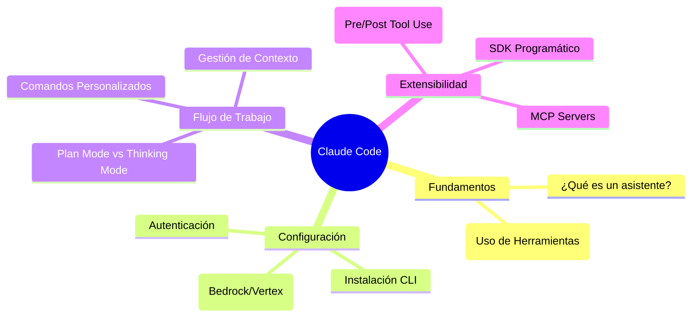

# 🤖 Claude Code: Dominando la IA en el Desarrollo

> [!summary] Estructura central de aprendizaje sobre **Claude Code**, el asistente de programación de Anthropic. Esta sección cubre desde la teoría básica hasta la automatización avanzada mediante el SDK y Hooks.

---

## 📑 Mapa de Contenido (MOC)

### 🧠 1. Conceptos y Arquitectura
- [[Whats a coding assistant?]] — El flujo de trabajo de un asistente y el poder del *Tool Use*.

### 🛠️ 2. Guía de Inicio y Configuración
- [[Claude Code Setup]] — Instalación en diferentes SO y configuración de entornos.

### 🚀 3. Operación y Productividad
- [[Claude Code in Action]] — Casos de uso reales: Optimización, Análisis y Estilizado.
- [[Hook and the SDK]] — Interceptación de herramientas y automatización programática.

### 🛡️ 4. Auditoría y Mejora Continua
- [[Useful Hooks]] — Prevención de errores de tipo y duplicidad de código.
- [[The Claude Code SDK]] — Integración de Claude en tus propios scripts de desarrollo.

### 📝 5. Evaluación
- [[Quiz Claude Code]] — Pon a prueba tus conocimientos sobre la herramienta.

---
**Volver a:** [[Softs-Skills]]
