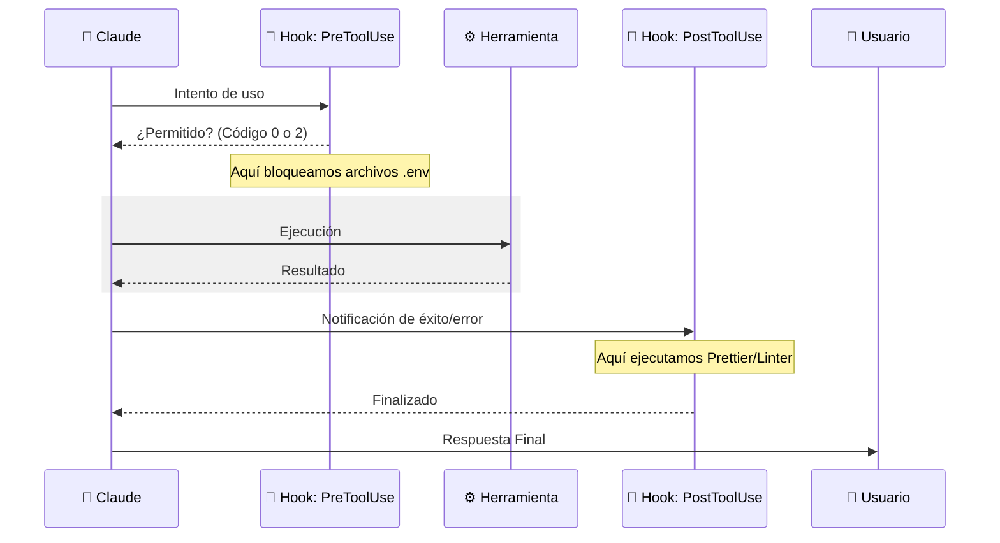
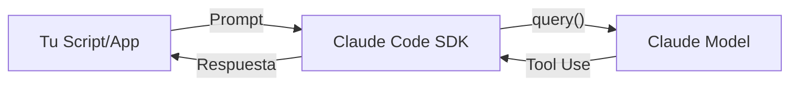

# 🪝 Hooks y el SDK de Claude Code

> [!abstract] Los **Hooks** y el **SDK** son las herramientas de personalización más potentes de Claude Code. Permiten integrar lógica externa en el ciclo de vida de la IA o ejecutar la IA dentro de tus propios scripts.

---

## 🏗️ El Ciclo de Vida de una Herramienta

Cuando Claude decide usar una herramienta, podemos interceptar esa acción mediante Hooks.

---

## 🛠️ Configuración de Hooks

Los hooks se definen en `.claude/settings.json`. Reciben un JSON por `stdin` y responden mediante códigos de salida.

| Código | Significado | Acción de Claude |
| :--- | :--- | :--- |
| **0** | Éxito | Continúa con la ejecución. |
| **2** | Bloqueo | Cancela y muestra el error de `stderr` a Claude. |

### Ejemplo: Bloqueo de archivos `.env` (PreToolUse)
![[Pasted image 20260305115011.png]]
> [!tip] Usa un script que verifique si el `file_path` en el input contiene `.env` y sal con `process.exit(2)` si es así.

---

## 📦 El SDK: IA Programática

El SDK permite ejecutar Claude Code como una función en tus aplicaciones.

### Características del SDK:
- **Solo lectura por defecto:** Mayor seguridad.
- **Hereda configuración:** Usa los mismos permisos y hooks del directorio.
- **Multilenguaje:** Disponible para TypeScript y Python.

![[Pasted image 20260305130705.png]]

---

## 🎯 Casos de Uso Reales

### Hooks Post-Edición
- Ejecutar `tsc` (TypeScript Compiler) para verificar que Claude no rompió tipos en otros archivos.
- Formatear código automáticamente tras una edición masiva (`MultiEdit`).

### SDK en CI/CD
- Crear un bot de revisión de Pull Requests que analice la duplicación de código.
- Automatizar la actualización de documentación técnica basada en cambios del código fuente.

---
**Volver a:** [[Claude-Code]]
