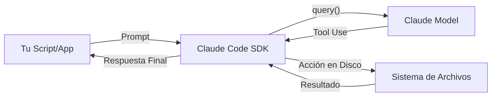

# 📦 The Claude Code SDK: IA Programática

> [!abstract] El SDK de Claude Code te permite ejecutar el poder de Claude directamente desde tus aplicaciones y scripts. Está disponible para **TypeScript**, **Python** y vía **CLI**, integrando la inteligencia de Claude en flujos de trabajo de desarrollo complejos.

---

## 🚀 Concepto Central

El SDK no es una versión "reducida"; ejecuta exactamente el mismo núcleo de Claude Code que usas en la terminal. Tiene acceso a todas las herramientas y puede completar tareas complejas de forma autónoma.



---

## ✨ Características Principales

- 🤖 **Ejecución Programática:** Automatiza tareas sin intervención manual.
- 🔄 **Paridad Total:** Misma funcionalidad que la versión de terminal.
- 📂 **Herencia de Configuración:** Respeta automáticamente los permisos y hooks definidos en el directorio `.claude`.
- 🛡️ **Seguridad (Read-only):** Por defecto, tiene permisos de solo lectura para evitar cambios accidentales.
- ⚙️ **Integración:** Ideal para pipelines de CI/CD, scripts de build y herramientas internas.

---

## 💻 Uso Básico (TypeScript)

A continuación, un ejemplo de cómo pedirle a Claude que analice duplicidades en un proyecto:

```typescript
import { query } from "@anthropic-ai/claude-code";

const prompt = "Busca consultas duplicadas en el directorio ./src/queries";

// El SDK devuelve un iterador asíncrono con la conversación mensaje a mensaje
for await (const message of query({
  prompt,
})) {
  console.log(JSON.stringify(message, null, 2));
}
```

> [!info] Al ejecutar esto, verás la conversación "en crudo" entre tu cliente local y el modelo de lenguaje. El último mensaje contiene la respuesta final procesada.

---

## 🔐 Gestión de Permisos

Por defecto, el SDK solo puede leer archivos y usar `grep`. Para permitirle realizar cambios, debes habilitar herramientas específicas:

### Activación Manual de Escritura
```typescript
for await (const message of query({
  prompt,
  options: {
    allowedTools: ["Edit"] // Habilita la edición de archivos
  }
})) {
  console.log(JSON.stringify(message, null, 2));
}
```

> [!tip] También puedes configurar estos permisos de forma global para el proyecto en `.claude/settings.json`, eliminando la necesidad de especificarlos en cada script.

---

## 🛠️ Aplicaciones Prácticas

Integrar el SDK transforma tu flujo de trabajo de "pasivo" a "inteligente":

1. **Git Hooks:** Revisión automática de calidad y estilo antes de cada commit.
2. **Scripts de Build:** Análisis dinámico para optimizar el bundle o detectar código muerto.
3. **Mantenimiento Automático:** Scripts que actualizan dependencias o refactorizan código antiguo.
4. **Documentación:** Generación automática de READMEs basada en el código fuente actual.
5. **CI/CD Pipelines:** Verificaciones de lógica de negocio o seguridad antes del despliegue.

---
**Volver a:** [[Claude-Code]]
