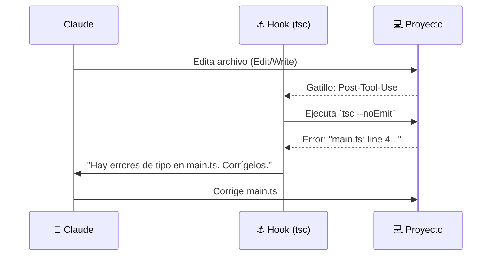
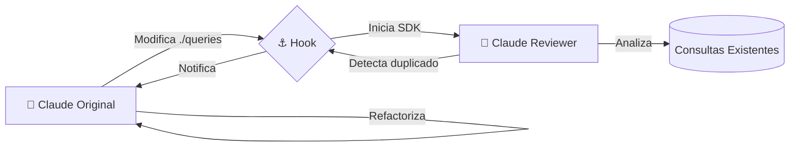

# ⚓ Hooks de Claude Code: Automatizando la Calidad

> [!abstract] Los Hooks en Claude Code permiten solucionar debilidades comunes en el desarrollo asistido por IA, especialmente en proyectos grandes. Funcionan como "centinelas" que proporcionan retroalimentación inmediata, previniendo errores antes de que se integren al código.

---

## 🏗️ 1. Hook de Verificación de Tipos (TypeScript)

**Problema:** Cuando Claude modifica la firma de una función (ej: añade un parámetro), suele actualizar la definición pero olvida las llamadas en otros archivos, generando errores de tipo "silenciosos".

> [!example] Escenario de error
> 1. Pides a Claude: "Añade el parámetro `verbose` a la función `saveData` en `schema.ts`".
> 2. Claude actualiza `schema.ts`.
> 3. **Error:** Claude olvida actualizar la llamada en `main.ts`.

### Solución: Post-Tool-Use Hook
Este hook ejecuta el compilador de TypeScript después de cada edición de archivo.

- **Acciones:** Captura errores de `tsc`, los inyecta en el prompt y obliga a Claude a corregirlos de inmediato.
- **Versatilidad:** Aplicable a cualquier lenguaje tipado (Go, Rust, Java) o mediante tests en lenguajes dinámicos.

---

## 🔍 2. Hook de Prevención de Duplicidad de Consultas

**Problema:** En proyectos con muchos archivos SQL/consultas, Claude tiende a crear funciones nuevas en lugar de reutilizar las existentes, ensuciando la base de código.

> [!example] Escenario: "El Slack Bot"
> Pides: "Crea una alerta de Slack para pedidos pendientes de >3 días".
> Claude escribe una consulta SQL nueva, ignorando que ya existe una función llamada `getPendingOrders()`.

### Arquitectura: "IA revisando a la IA"
Este hook es más avanzado: utiliza una **segunda instancia independiente de Claude** para auditar el trabajo de la primera.

1. **Gatillo:** Se activa al modificar archivos en carpetas críticas (ej: `./queries`).
2. **Revisión:** Una instancia de Claude mediante el SDK revisa si la nueva consulta ya existe.
3. **Feedback:** Si hay duplicidad, se le ordena a la instancia original eliminar el código nuevo y usar la función existente.

---

## ⚖️ Consideraciones de Implementación

| Característica | Hook de TypeScript | Hook de Duplicidad |
| :--- | :--- | :--- |
| **Tipo** | Post-Tool-Use | Pre o Post Tool-Use |
| **Carga** | Ligera (Rápido) | Pesada (Uso de API extra) |
| **Impacto** | Estabilidad del código | Mantenibilidad / Clean Code |
| **Recomendación** | Siempre activo | Solo en directorios críticos |

> [!warning] El hook de duplicidad requiere más recursos y tiempo, ya que lanza una instancia separada de Claude por cada revisión. Se recomienda monitorear solo carpetas de alto valor.

---

## 💡 Principios de Extensión

Estos conceptos demuestran que puedes convertir a Claude en un desarrollador más responsable siguiendo estos principios:
- **Feedback Inmediato:** Usa la salida de compiladores/linters.
- **Auditoría Externa:** Implementa procesos de revisión con instancias de IA independientes.
- **Foco Estratégico:** Prioriza la consistencia en directorios donde el desorden escala rápido.
- **Equilibrio:** Balancea el beneficio de la automatización frente al coste de rendimiento/API.

---
**Volver a:** [[Claude-Code]]

---
![[Pasted image 20260427184902.png]]

![[Pasted image 20260427184909.png]]