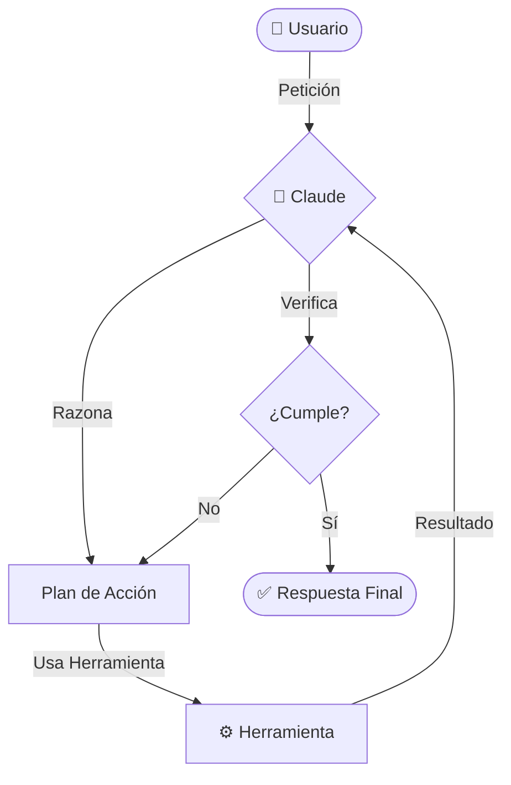
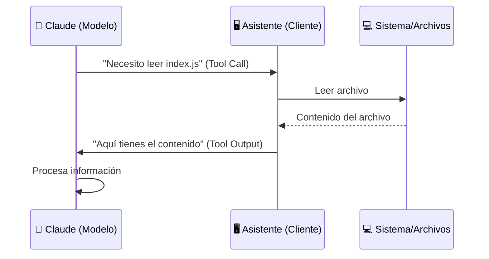

# 🤖 ¿Qué es un Asistente de Programación?

> [!quote] Un asistente de programación como Claude Code no es solo un chat; es un agente que imita el proceso de razonamiento y ejecución de un desarrollador humano.

---

## 🔄 El Flujo de Razonamiento

Cuando le asignas una tarea (ej: "corrige este error"), el asistente sigue un ciclo iterativo de **Pensar -> Actuar -> Validar**.

![[Pasted image 20260305114451.png]]

---

## ⚙️ Tool Use: La Clave del Poder

> [!important] Los modelos de lenguaje por sí solos no pueden "tocar" tu código. Necesitan herramientas.

- **Definición:** El modelo recibe instrucciones sobre cómo solicitar el uso de funciones específicas (leer archivo, ejecutar comando, etc.).
- **Ejecución:** Claude Code actúa como el "cuerpo" que ejecuta la herramienta y le devuelve los datos al "cerebro" (Claude).

![[Pasted image 20260305112648.png]]

---

## 🛡️ Ventajas de Claude Code

### 1. Seguridad Local
Claude Code opera principalmente en tu máquina. **No depende de indexar toda tu base de código** en servidores externos, lo que protege tu IP.

### 2. Extensibilidad (MCP)
Mediante el **Model Context Protocol (MCP)**, puedes dar a Claude nuevas "habilidades" como navegar por la web o consultar bases de datos.

### 3. Tareas Complejas
A diferencia de un autocompletado simple, Claude puede:
- 🔹 **Combinar herramientas:** Leer un log -> Buscar el archivo -> Editar -> Ejecutar test.
- 🔹 **Aprender flujos nuevos:** Usa herramientas que no conocía previamente mediante sus descripciones.

---
**Volver a:** [[Claude-Code]]
