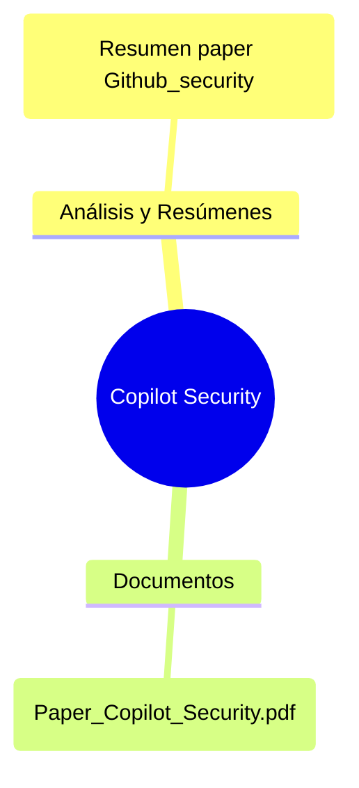

# 🛡️ GitHub Copilot Security

> [!summary] Carpeta principal de notas sobre la seguridad en GitHub Copilot y la investigación académica relacionada.

---

## 📑 Índice de Notas

### 🧠 Análisis y Resúmenes

- [[Resumen paper Github_security]]

### 📄 Documentos de Referencia

- [[Paper_Copilot_Security.pdf]]
