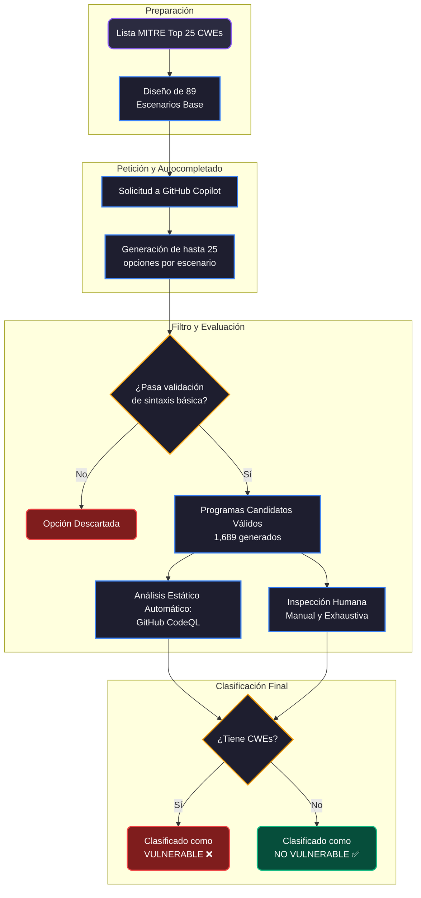
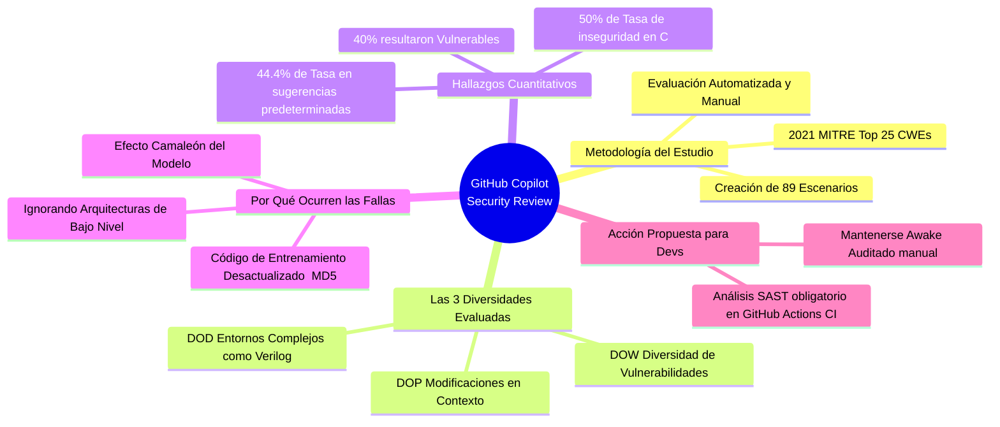

# 🤖 Resumen: Asleep at the Keyboard? Assessing the Security of GitHub Copilot’s Code Contributions

🔗 **Documento Original:** [[Paper_Copilot_Security.pdf]]

> [!abstract] Resumen Ejecutivo
> El documento investiga empíricamente si GitHub Copilot, al haber sido entrenado con repositorios públicos de código sin filtrado exhaustivo (incluyendo código inseguro y vulnerable), tiende a generar sugerencias automáticas de programación que contienen fallas de seguridad documentadas por la industria (CWEs). **El hallazgo principal es que aproximadamente el 40% de las veces, las sugerencias generadas presentan una vulnerabilidad de software.**
---

## 📖 1. Introducción y Contexto

**GitHub Copilot** se promociona como un "Programador en pareja basado en IA" (*AI pair programmer*). Está construido sobre **Codex** de OpenAI, una variante del modelo **GPT-3** que ha sido afinada (fine-tuned) con miles de repositorios de GitHub.

> [!warning] El Problema Fundamental
> El modelo ha asimilado billones de líneas de código de código abierto, aprendiendo lo "bueno", pero también heredando los **anti-patrones, malas prácticas, bugs y código legado**. Como no existe una curación estricta orientada a la seguridad en el set de datos masivo inicial, el modelo puede replicar y sugerir soluciones que inyectan brechas de riesgo directas al software de producción.

El objetivo central del artículo es realizar una **auditoría y cuantificación sistemática** de estas sugerencias vulnerables.

---

## 🎯 2. Metodología y Parámetros del Estudio

Para lograr la medición, los autores no esperaron pasivamente, sino que **indujeron** respuestas desde el modelo diseñando *prompts* (escenarios incompletos de código) con contextos neutrales pero altamente enfocados y peligrosos. Guiaron su experimento utilizando el listado oficial y crítico: **[MITRE 2021 CWE Top 25 Most Dangerous Software Weaknesses]**.

### 📐 Las Tres Dimensiones Experimentales (Diversidades)

El experimento diseccionó el comportamiento de Copilot a lo largo de tres "Ejes" (Diversity Axes):

1. **🧩 DOW (Diversity of Weakness / Diversidad de Debilidad):**
   Mide la propensión de la IA a incurrir en vulnerabilidades específicas abarcando la variedad de los distintos CWEs (ej: *SQL Injection*, *Buffer Overflow*, *XSS*). 
2. **📝 DOP (Diversity of Prompt / Diversidad del Contexto):**
   Mide cómo ligeras variaciones humanas en la forma en la que se pide o documenta el código (el *prompt* circundante) influyen fuertemente en si la máquina escribirá algo seguro o no.
3. **🌐 DOD (Diversity of Domain / Diversidad de Dominio):**
   Prueba el rendimiento en un terreno menos explorado, pidiendo a Copilot autocompletar lenguajes de bajo nivel, como **Verilog** para descripciones de hardware (RTL), y midiendo vulnerabilidades específicas a nivel de arquitectura.

> [!info] Herramientas de Análisis
> El escaneo y comprobación de las vulnerabilidades generadas se llevó a cabo combinando:
> - **Análisis automatizado:** Usando **GitHub CodeQL** (la propia herramienta de escaneo estático de seguridad de GitHub evaluando a Copilot de GitHub).
> - **Inspección manual:** Realizada exhaustivamente por los autores para las reglas complejas que requerían contexto estructural adicional que CodeQL no puede alcanzar o no soporta plenamente (como las métricas completas para Verilog).

### 🛠️ Flujo de Trabajo (Diagrama de Arquitectura de Evaluación)

---

## 📊 3. Resultados Cuantitativos Principales

Durante la fase intensiva DOW (Diversity of Weakness) usando lenguajes **C** y **Python** para evaluar 18 debilidades clave, Copilot generó fragmentos que conformaron múltiples programas válidos para someterlos a análisis.

| Categoría Analizada | Volumen de Muestras | Porcentaje de Código Vulnerable |
| :--- | :---: | :---: |
| **Total Global del Estudio** | ~1,689 programas | **~40.0%** ⚠️ |
| **Lenguaje C (Subset DOW)** | 513 programas | **50.29%** 🧨 |
| **Lenguaje Python (Subset DOW)** | 571 programas | **38.35%** 🟠 |
| **Top-Scoring Options (La opción recomendada por defecto)** | - | **44.44%** 🛑 |

> [!danger] La "Sensación de Falsa Seguridad"
> El detalle más alarmante revelado por la tabla no es solo el 40% general, sino que **casi el 45% de las veces la sugerencia por defecto (la rankeada como principal por el propio motor y mostrada al instante en el editor del programador)** contenía fallas de seguridad documentadas y severas.

---

## 🔍 4. Hallazgos Clave y Causas del Comportamiento

Los autores identificaron varios comportamientos fascinantes dictados por la arquitectura del modelo de lenguaje (LLM):

1. **🧩 Efecto Camaleón ("Ajustándose al Entorno"):**
   Copilot, como todo modelo probabilístico (GPT-3), busca predecir el texto intentando encajar armónicamente con el contexto inmediato. Si tu proyecto tiene código inseguro antiguo o estilos dudosos a su alrededor, Copilot adaptará su respuesta para **mimetizarse con ese entorno vulnerable**, perpetuando la fragilidad (por ejemplo, si usas strings sin sanitizar, completará la inyección SQL de forma no parametrizada).
   
2. **🕰️ Perpetuación de Código Obsoleto (Peligro de los Datos Legados):**
   Las buenas prácticas envejecen. En el masivo set de entrenamiento hay código de hace una década donde usar algoritmos de hash como `MD5` o criptografía simple como `SHA-256` se consideraba "seguro". Hoy esto es fuertemente vulnerable frente a fuerza bruta, pero la IA no entiende la linealidad del tiempo ni las "deprecaciones" de software, recomendando a ciegas estándares descontinuados en lugar de librerías modernas y vigentes (como `bcrypt` o `Argon2`).
   
3. **💥 Carencia de Contexto Abstracto (Limits de Memoria y Arquitectura):**
   En arquitecturas de lenguajes de bajo nivel como C, lidiar con márgenes y tamaños seguros para una reserva de memoria (*Buffer Allocation*) a menudo requiere información estructural del software mucho más allá de las 10 líneas de contexto local. Como Copilot se enfoca agresivamente en resolver funcionalmente la declaración, esto comúnmente desencadena desbordamientos peligrosos referenciados como **Buffer Overflows (CWE-120/119)**, ya que el modelo asume límites que no constató previamente.

---

## 🚧 5. Amenazas a la Validez del Estudio (Limitaciones)

Para ser justos metodológicamente, los autores del paper documentaron limitantes francas en su investigación, llevada a cabo durante el ciclo "Technical Preview" de Copilot:

- **Limitaciones Estáticas del Analizador (CodeQL):** Escanear reglas de forma algorítmica y estática es extremadamente complicado; el evaluador a veces choca y no logra procesar restricciones de longitud abstractas que podrían estar aseguradas operativamente, o requiere atributos subjetivos ("¿Es esto realmente un archivo peligroso? Es difícil codificar ese criterio estáticamente").
- **Opacidad del Modelo (Naturaleza "Black-Box"):** GitHub actualiza y despliega su modelo y weights remotamente sin aviso. Además, Copilot realimenta sus iteraciones. Por tanto, repetir el experimento mes a mes no es determinístico y lo que era inseguro ayer en un prompt 1, puede arrojar un resultado corregido un año o unos meses después debido al afinamiento constante.
- **De Micro-escenarios a Código "Real":** Utilizar trozos de programas pequeños en escenarios controlados es excelente en el laboratorio, pero podría no ser totalmente reflejo de cómo se comporta el modelo insertado en *monolitos reales* con miles de implementaciones de abstracción, librerías robustas orientadas a seguridad y context-matching profundo dentro de empresas enormes y maduras.

---

## 🏁 6. Conclusiones y Takeaways Recomendados

Copilot y herramientas adyacentes representan un avance asombroso en productividad de hiper-completamiento e iteración; sin embargo, su **confiabilidad inherente para delegar lógicas o componentes de seguridad críticos o de autorización, es nula por sí sola.**

> [!check] Resumen de Buenas Prácticas al utilizar Asistentes IA de Código:
> - 👁️ **Eres un Piloto, Mantente "Awake":** Audita meticulosamente, valida lo que genera la herramienta, especialmente si afecta bases de datos, contraseñas, subida y manipulación de archivos y buffers dinámicos de memoria.
> - 🛡️ **SAST Integrado e Indispensable:** Todo componente de software autocompletado hoy en día debe validarse fuertemente cruzado contra canalizaciones seguras automáticas (*Static Application Security Testing* como CodeQL, SonarQube, etc) dentro de los procesos de CI/CD del equipo de DevOps antes de enviarse a producción primaria.
> - 🧠 No presupongas "inmunidad y modernidad"; juzga la salida del Asistente frente al estado del arte vigente.

### 🌐 Resumen Relacional (Mindmap)

