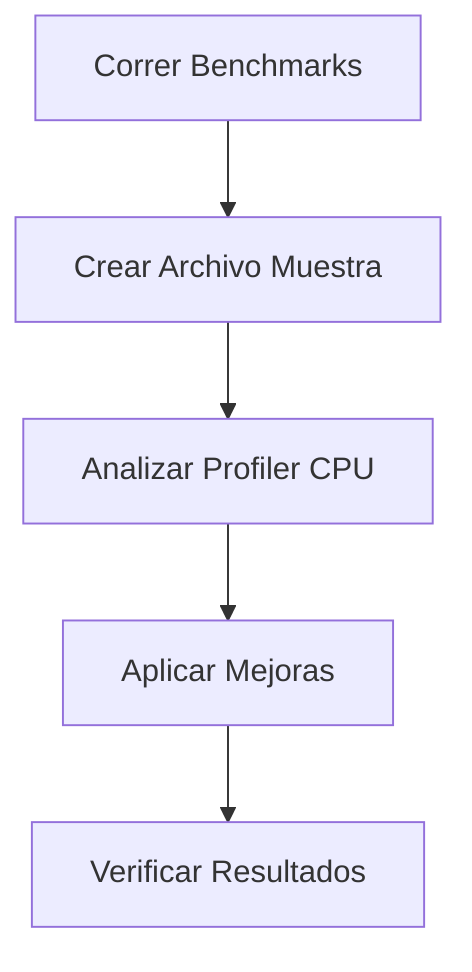
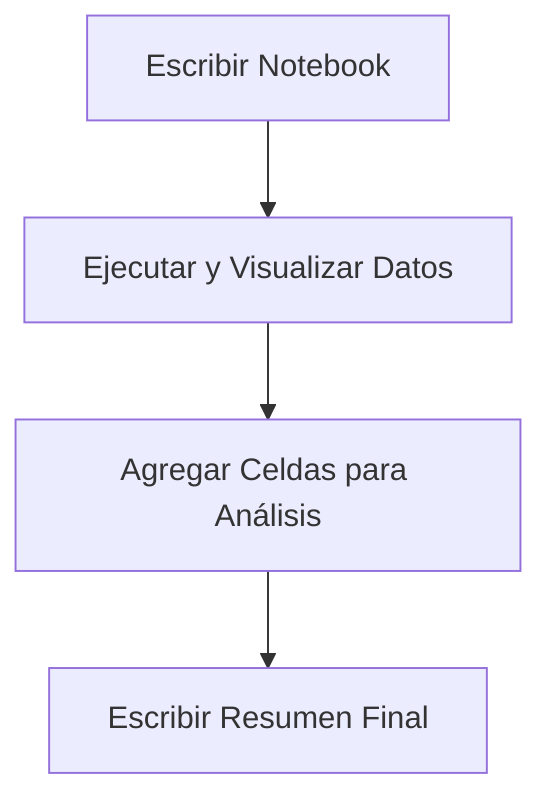
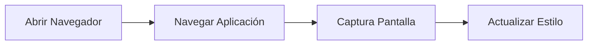
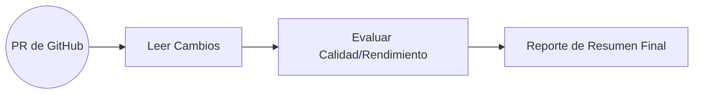

## Herramientas en Claude Code

![[Pasted image 20260305115011.png]]

---

## Tarea de Optimizacion

### Flujo de Trabajo

- `Tarea(Izquierda):` Ejecutar pruebas de rendimiento (Benchmarks) para la libreria Chalk. Para cualquier resultado que parezca lento, encontrar la causa raiz y solucionarlo.
- `Centro:` Codigo de Claude(Claude Code)

### Pasos a Seguir

1. **Ejecutar pruebas de Rendimiento:** Correr Benchmarks iniciales.
2. **Escribir un archivo de muestra:** Crear un Archivo para explorar el peor de los casos (worst case).
3. **Usar un Perfilador de CPU:** Utilizar la CPU profiler y analizar resultados.
4. **Implementar mejoras:** Aplicar los cambios necesarios para optimizar el código.
5. **Verificar mejoras:** Comprobar que los cambios realmente funcionaron.



```shell
npm install chalk
```

![[Pasted image 20260305115719.png]]

---

## Data Analysis Task

> Encontrar informacion relevante(insights) utilizando datos sobre usuarios de una plataforma de streaming de video.

### Flujo de analisis de Datos

- `Tarea(izquierda):` Realizar un analisis sobre los datos en el archivo `Streaming.csv`
- `Centro:` Codigo de Claude(Claude Code)

### Pasos a Seguir

- **Escribir código en un cuaderno (Notebook):** Para examinar el formato de datos.
- **Ejecutar el código y examinar los resultados:** Para ver los hallazgos iniciales.
- **Agregar Celdas:** Ejecutando cada una para guiar el análisis.
- **Escribir un resumen final:** Para concluir el estudio.



![[Pasted image 20260305130705.png]]

---

## Tarea de Estilizado de Interfaz (UI Styling Task)

> [!summary] **Objetivo:** Mejorar el diseno de una aplicacion, enfocandose en la interfaz de chat y el encabezado

-> `Herramienta(Playwright MCP Server):` Conjunto de herramientas que permiten a Claude controlar el navegador:

### Pasos De Claude Code

- Abrir el Navegador
- Navegar hacia la aplicación
- Tomar una captura de pantalla (screenshot)
- Actualizar el estilo visual



![[Pasted image 20260305132223.png]]

---

## Integracion con Github

### Entradas (Izquierda)

- `Tarea:` Revisar los cambios en la solicitud de extraccion (pull request)
- `Servidor MCP de Github:` Conjunto de herramientas que permiten a Claude interactuar con Github

### Proceso Central

- Claude Code(El nucleo de procesamiento de IA)

### Salidas/Acciones (Derecha)

1. **Leer los cambios** en la solicitud de extracción.
2. **Evaluar la calidad del código**, el rendimiento, etc.
3. **Escribir el informe** de resumen.



![[Pasted image 20260305133646.png]]

## Example

![[Pasted image 20260305134132.png]]

---
