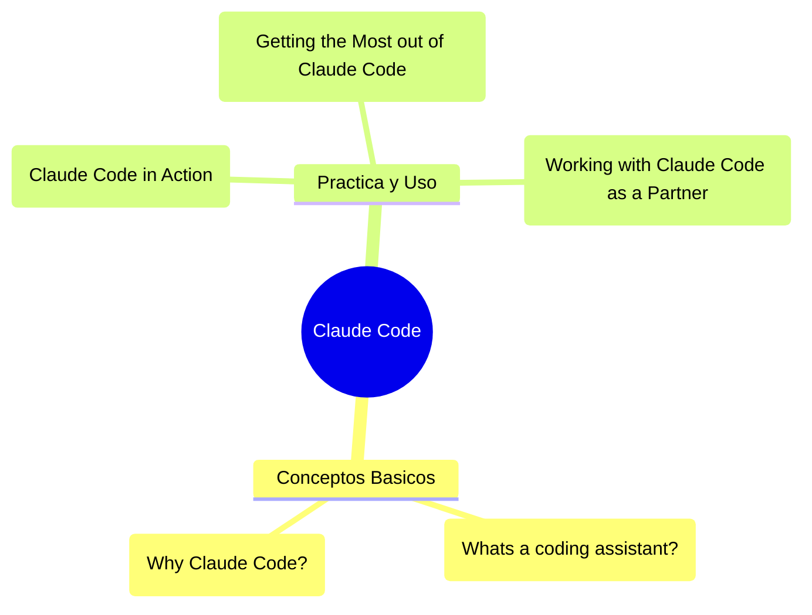

# Claude Code

> [!summary] Carpeta principal de notas sobre Claude / Claude Code (asistente de código).

## Índice de Notas

- [[Getting the Most out of Claude Code]]
- [[Whats a coding assistant?]]
- [[Why Claude Code?]]
- [[Working with Claude Code as a Partner]]
- [[Claude Code in Action]]
