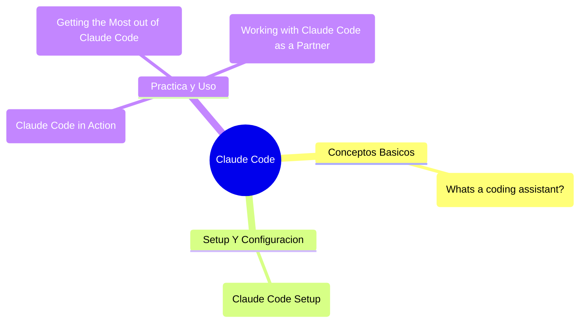

# 🤖 Claude Code

> [!summary] Carpeta principal de notas sobre Claude / Claude Code (asistente de código).

---

## 📑 Índice de Notas

### 🧠 Conceptos Básicos

- [[Whats a coding assistant?]]

### 🛠️ Setup y Configuración

- [[Claude Code Setup]]

### 🚀 Práctica y Uso

- [[Claude Code in Action]]
- [[Making Changes in Claude Code]]
- [[Hook and the SDK]]
