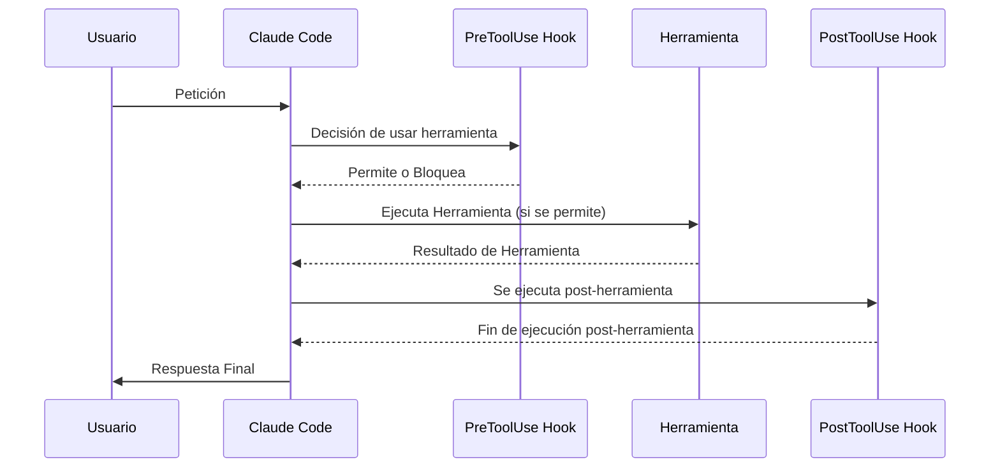
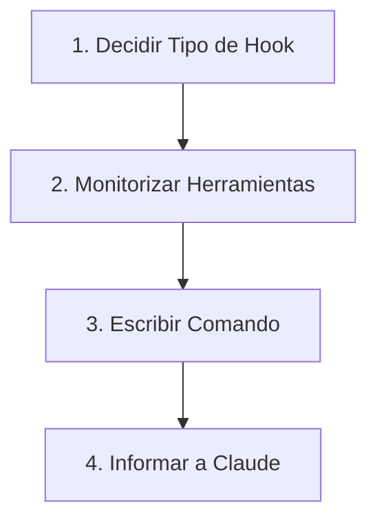
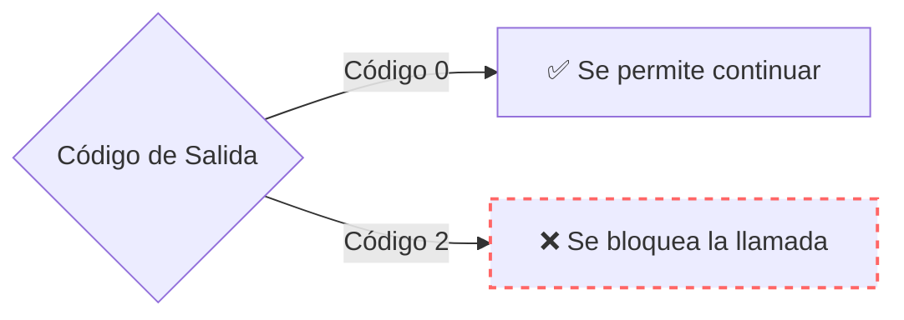

# 🪝 Hook and the SDK

> [!important] Los hooks permiten ejecutar comandos antes o después de que Claude intente ejecutar una herramienta. Son increíblemente útiles para implementar flujos de trabajo automatizados, como ejecutar formateadores de código después de editar archivos, ejecutar pruebas cuando se modifican archivos o bloquear el acceso a archivos específicos.

![[Pasted image 20260313143249.png]]

---

## ⚙️ How Hooks Work

> [!info] Para entender los hooks, primero revisemos el flujo normal al interactuar con Claude Code. Cuando le haces una pregunta a Claude, tu consulta se envía al modelo de Claude junto con las definiciones de las herramientas. Claude puede decidir usar una herramienta proporcionando una respuesta formateada, y luego Claude Code ejecuta esa herramienta y devuelve el resultado.

- 🔹 Los hooks se insertan en este proceso, lo que te permite ejecutar código justo antes o justo después de que se ejecute la herramienta.



![[Pasted image 20260313142356.png]]

- Existen dos tipos de ganchos:

1. **Ganchos PreToolUse:** Se ejecutan *antes* de que se llame a una herramienta.
2. **Ganchos PostToolUse:** Se ejecutan *después* de que se llame a una herramienta.

---

## 🔧 Hook Configuration

> [!note] Los hooks se definen en los archivos de configuración de Claude. Puedes agregarlos a:

- **Global:** `~/.claude/settings.json` (afecta a todos los proyectos)
- **Proyecto:** `.claude/settings.json` (compartido con el equipo)
- **Proyecto (no confirmado):** `.claude/settings.local.json` (configuración personal)

> [!tip] Puedes escribir los hooks manualmente en estos archivos o usar el comando `/hooks` dentro de Claude Code.

![[Pasted image 20260313142712.png]]

- 🔹 La estructura de configuración incluye dos secciones principales:

![[Pasted image 20260313142741.png]]

---

## 🛑 Ganchos PreToolUse

> [!abstract] Los ganchos PreToolUse se ejecutan antes de que se ejecute una herramienta. Incluyen un comparador que especifica a qué tipos de herramientas se debe aplicar:

```json
"PreToolUse": [
  {
    "matcher": "Read",
    "hooks": [
      {
        "type": "command",
        "command": "node /home/hooks/read_hook.ts"
      }
    ]
  }
]
```

> [!quote] Antes de ejecutar la herramienta «Leer», esta configuración ejecuta el comando especificado. Su comando recibe detalles sobre la llamada a la herramienta que Claude desea realizar, y usted puede:

- ✅ Permitir que la operación se ejecute con normalidad
- ❌ Bloquear la llamada a la herramienta y enviar un mensaje de error a Claude

---

## 🔄 Ganchos PostToolUse

> [!abstract] Los ganchos PostToolUse se ejecutan después de que se haya ejecutado una herramienta. Aquí hay un ejemplo que se activa después de operaciones de escritura, edición o edición múltiple:

```json
"PostToolUse": [
  {
    "matcher": "Write|Edit|MultiEdit",
    "hooks": [
      {
        "type": "command", 
        "command": "node /home/hooks/edit_hook.ts"
      }
    ]
  }
]
```

> [!quote] Dado que la llamada a la herramienta ya se ha producido, los ganchos PostToolUse no pueden bloquear la operación. Sin embargo, sí pueden:

- 🛠️ Ejecutar operaciones posteriores (como formatear un archivo que acaba de editarse)
- 📊 Proporcionar información adicional a Claude sobre el uso de la herramienta

![[Pasted image 20260313143018.png]]

---

## 💡 Aplicaciones Practicas

- 🔹 Aquí tienes algunas formas comunes de usar los hooks:

- **Formato de código:** Formatea automáticamente los archivos después de que Claude los edite.
- **Pruebas:** Ejecuta pruebas automáticamente cuando se modifican archivos.
- **Control de acceso:** Impide que Claude lea o edite archivos específicos.
- **Calidad del código:** Ejecuta analizadores de código o verificadores de tipos y proporciona retroalimentación a Claude.
- **Registro de eventos:** Registra los archivos a los que Claude accede o modifica.
- **Validación:** Comprueba las convenciones de nomenclatura o los estándares de codificación.

> [!summary] La clave está en que los hooks te permiten ampliar las capacidades de Claude Code integrando tus propias herramientas y procesos en el flujo de trabajo. Los hooks PreToolUse te dan control sobre lo que Claude puede hacer, mientras que los hooks PostToolUse te permiten mejorar lo que Claude ha hecho.

---

# 🪝 Definiendo Hooks

> [!info] Los hooks en Claude Code permiten interceptar y controlar las llamadas a las herramientas antes o después de su ejecución. Esto proporciona un control preciso sobre lo que Claude puede y no puede hacer en tu entorno de desarrollo.

---

## 🛠️ Construyendo el Hook

> [!tip] La creación de un gancho implica cuatro pasos principales:

![[Pasted image 20260313145915.png]]



1. **Decide si usarás un hook PreToolUse o PostToolUse:** los hooks PreToolUse impiden la ejecución de llamadas a herramientas, mientras que los PostToolUse se ejecutan después de que la herramienta ya se haya utilizado.
2. **Determina qué tipo de llamadas a herramientas quieres monitorizar:** debes especificar exactamente qué herramientas deben activar tu hook.
3. **Escribe un comando que reciba la llamada a la herramienta:** este comando obtiene datos JSON sobre la llamada propuesta a través de la entrada estándar.
4. **Si es necesario, el comando debe proporcionar información a Claude:** el código de salida del comando le indica a Claude si debe permitir o bloquear la operación.

---

## 🧰 Herramientas Disponibles

> [!note] Claude Code ofrece varias herramientas integradas que puedes monitorizar mediante hooks:

![[Pasted image 20260313150101.png]]

> [!quote] Para ver exactamente qué herramientas están disponibles en tu configuración actual, puedes solicitarle una lista directamente a Claude. Esto es especialmente útil, ya que las herramientas disponibles pueden cambiar al agregar servidores MCP personalizados.

---

## 📦 Estructura de Datos de la llamada de la Herramienta

> [!abstract] Cuando se ejecuta el comando de enlace, Claude envía datos JSON a través de la entrada estándar con detalles sobre la llamada a la herramienta propuesta:

![[Pasted image 20260313150204.png]]

```json
{
  "session_id": "2d6a1e4d-6...",
  "transcript_path": "/Users/sg/...",
  "hook_event_name": "PreToolUse",
  "tool_name": "Read",
  "tool_input": {
    "file_path": "/code/queries/.env"
  }
}
```

> [!info] Tu comando lee este JSON de la entrada estándar, lo analiza y luego decide si permite o bloquea la operación según el nombre de la herramienta y los parámetros de entrada.

---

## 🚦 Codigo de Salida y Flujo de Control

> [!abstract] Tu comando de enlace se comunica con Claude mediante códigos de salida:

![[Pasted image 20260313150321.png]]



- 🟢 **Código de salida 0:** Todo está correcto, se permite que la llamada a la herramienta continúe.
- 🔴 **Código de salida 2:** Se bloquea la llamada a la herramienta (solo en hooks PreToolUse).

> [!warning] Al salir con el código 2 en un hook PreToolUse, cualquier mensaje de error que se escriba en la salida de error estándar se enviará a Claude como retroalimentación, explicando por qué se bloqueó la operación.

---

## 🎯 Ejemplo de Caso de Uso

> [!example] Un caso de uso común es impedir que Claude lea archivos confidenciales como los archivos `.env`. Dado que tanto la herramienta `Read` como la herramienta `Grep` pueden acceder al contenido de los archivos, conviene monitorizar ambas y comprobar si intentan acceder a rutas de archivo restringidas.

> [!summary] Este enfoque proporciona un control total sobre el acceso de Claude al sistema de archivos, a la vez que ofrece información clara sobre por qué se restringen ciertas operaciones.
