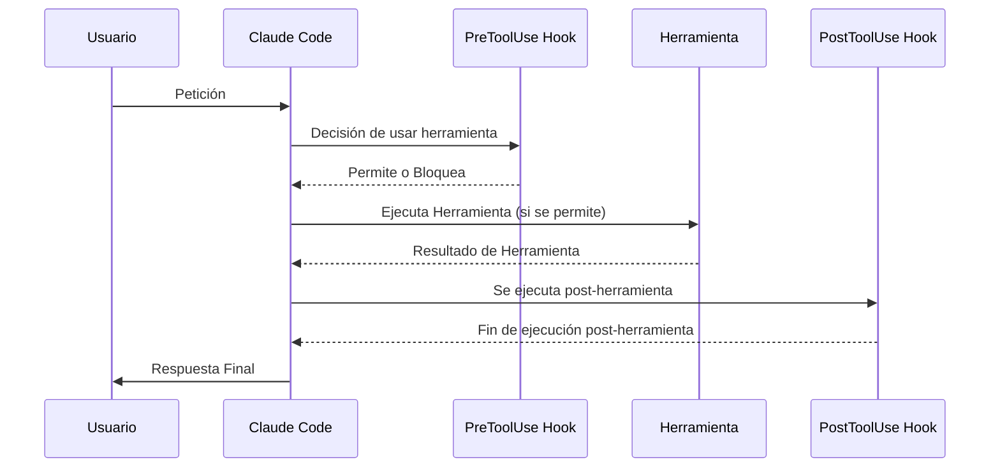

# 🪝 Hook and the SDK

> [!important] Los hooks permiten ejecutar comandos antes o después de que Claude intente ejecutar una herramienta. Son increíblemente útiles para implementar flujos de trabajo automatizados, como ejecutar formateadores de código después de editar archivos, ejecutar pruebas cuando se modifican archivos o bloquear el acceso a archivos específicos.

![[Pasted image 20260313143249.png]]

---

## ⚙️ How Hooks Work

> [!info] Para entender los hooks, primero revisemos el flujo normal al interactuar con Claude Code. Cuando le haces una pregunta a Claude, tu consulta se envía al modelo de Claude junto con las definiciones de las herramientas. Claude puede decidir usar una herramienta proporcionando una respuesta formateada, y luego Claude Code ejecuta esa herramienta y devuelve el resultado.

- 🔹 Los hooks se insertan en este proceso, lo que te permite ejecutar código justo antes o justo después de que se ejecute la herramienta.



![[Pasted image 20260313142356.png]]

- Existen dos tipos de ganchos:

1. **Ganchos PreToolUse:** Se ejecutan *antes* de que se llame a una herramienta.
2. **Ganchos PostToolUse:** Se ejecutan *después* de que se llame a una herramienta.

---

## 🔧 Hook Configuration

> [!note] Los hooks se definen en los archivos de configuración de Claude. Puedes agregarlos a:

- **Global:** `~/.claude/settings.json` (afecta a todos los proyectos)
- **Proyecto:** `.claude/settings.json` (compartido con el equipo)
- **Proyecto (no confirmado):** `.claude/settings.local.json` (configuración personal)

> [!tip] Puedes escribir los hooks manualmente en estos archivos o usar el comando `/hooks` dentro de Claude Code.

![[Pasted image 20260313142712.png]]

- 🔹 La estructura de configuración incluye dos secciones principales:

![[Pasted image 20260313142741.png]]

---

## 🛑 Ganchos PreToolUse

> [!abstract] Los ganchos PreToolUse se ejecutan antes de que se ejecute una herramienta. Incluyen un comparador que especifica a qué tipos de herramientas se debe aplicar:

```json
"PreToolUse": [
  {
    "matcher": "Read",
    "hooks": [
      {
        "type": "command",
        "command": "node /home/hooks/read_hook.ts"
      }
    ]
  }
]
```

> [!quote] Antes de ejecutar la herramienta «Leer», esta configuración ejecuta el comando especificado. Su comando recibe detalles sobre la llamada a la herramienta que Claude desea realizar, y usted puede:

- ✅ Permitir que la operación se ejecute con normalidad
- ❌ Bloquear la llamada a la herramienta y enviar un mensaje de error a Claude

---

## 🔄 Ganchos PostToolUse

> [!abstract] Los ganchos PostToolUse se ejecutan después de que se haya ejecutado una herramienta. Aquí hay un ejemplo que se activa después de operaciones de escritura, edición o edición múltiple:

```json
"PostToolUse": [
  {
    "matcher": "Write|Edit|MultiEdit",
    "hooks": [
      {
        "type": "command", 
        "command": "node /home/hooks/edit_hook.ts"
      }
    ]
  }
]
```

> [!quote] Dado que la llamada a la herramienta ya se ha producido, los ganchos PostToolUse no pueden bloquear la operación. Sin embargo, sí pueden:

- 🛠️ Ejecutar operaciones posteriores (como formatear un archivo que acaba de editarse)
- 📊 Proporcionar información adicional a Claude sobre el uso de la herramienta

![[Pasted image 20260313143018.png]]

---

## 💡 Aplicaciones Practicas

- 🔹 Aquí tienes algunas formas comunes de usar los hooks:

- **Formato de código:** Formatea automáticamente los archivos después de que Claude los edite.
- **Pruebas:** Ejecuta pruebas automáticamente cuando se modifican archivos.
- **Control de acceso:** Impide que Claude lea o edite archivos específicos.
- **Calidad del código:** Ejecuta analizadores de código o verificadores de tipos y proporciona retroalimentación a Claude.
- **Registro de eventos:** Registra los archivos a los que Claude accede o modifica.
- **Validación:** Comprueba las convenciones de nomenclatura o los estándares de codificación.

> [!summary] La clave está en que los hooks te permiten ampliar las capacidades de Claude Code integrando tus propias herramientas y procesos en el flujo de trabajo. Los hooks PreToolUse te dan control sobre lo que Claude puede hacer, mientras que los hooks PostToolUse te permiten mejorar lo que Claude ha hecho.
