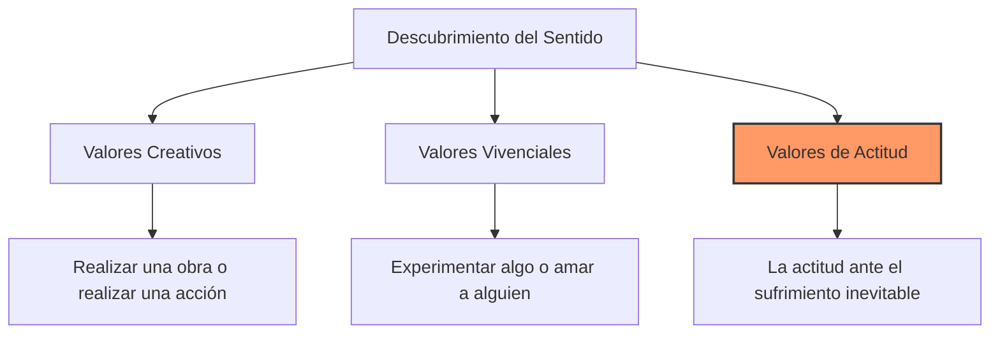

# Análisis Profundo: El hombre en busca de sentido

Este libro no es solo un relato testimonial del Holocausto, sino un tratado científico sobre la capacidad humana de trascender el sufrimiento a través del descubrimiento de un **sentido**.

## I. Análisis Fenomenológico: Las Tres Fases del Prisionero

Frankl identifica tres etapas psicológicas que experimenta el individuo sometido a condiciones extremas:

1.  **Fase de Internamiento (El Shock):**
    *   **Ilusión del Indulto:** El mecanismo de defensa inicial donde el condenado cree que será salvado en el último minuto.
    *   **La Primera Selección:** El "juego del dedo" del oficial de las SS que decide la vida o la muerte inmediata (90% al crematorio).
    *   **Despojo de la identidad:** La pérdida de todo vínculo material (documentos, ropa, posesiones) reduciendo al hombre a su "existencia desnuda".

2.  **Fase de Vida en el Campo (La Apatía):**
    *   **Muerte Emocional:** El prisionero desarrolla una anestesia afectiva para protegerse de la crueldad y la muerte constante.
    *   **Regresión:** El retorno a un nivel de instintos básicos (hambre, sueño) y la desaparición del deseo sexual.
    *   **Vida Interior como Refugio:** El amor (el recuerdo de la esposa) y la naturaleza (puestas de sol) actúan como mecanismos de supervivencia espiritual.

3.  **Fase tras la Liberación (La Despersonalización):**
    *   **Pérdida de la capacidad de alegría:** El cerebro necesita reaprender a sentir tras años de embotamiento.
    *   **Riesgos Morales:** La tendencia del liberado a convertirse en opresor justificándose en su sufrimiento pasado.
    *   **Amargura y Desencanto:** La crisis de descubrir que el mundo exterior no es como se soñó o que los seres amados ya no están.

---

## II. La Logoterapia: Conceptos Fundamentales

Frankl propone la **Logoterapia** como la "Tercera Escuela Vienesa de Psicoterapia", centrada en el *Logos* (sentido).

### La Tríada del Sentido
Para Frankl, la vida tiene sentido bajo cualquier condición, y se puede descubrir de tres formas:

### Conceptos Clave
*   **Voluntad de Sentido:** La fuerza motivacional primaria del hombre, superior al placer (Freud) o al poder (Adler).
*   **Vacío Existencial:** Se manifiesta en el tedio y la falta de propósito. Es la neurosis de nuestro tiempo.
*   **Neurosis Noógena:** Neurosis que no nace de conflictos pulsionales, sino de problemas espirituales o existenciales.
*   **Autotrascendencia:** El hombre solo se realiza cuando se olvida de sí mismo y se entrega a una causa o a otra persona.
*   **Intención Paradójica:** Técnica clínica donde se invita al paciente a desear precisamente aquello que teme (útil en fobias y obsesiones).

---

## III. El Sufrimiento y el Destino

> "El sufrimiento deja de ser sufrimiento en el momento en que encuentra un sentido".

Frankl sostiene que el hombre es un ser capaz de decidir su actitud ante las circunstancias. Incluso en el campo de concentración, el hombre podía conservar su dignidad humana. La libertad interior es el último reducto que nadie puede arrebatar.

### El Metasentido (Suprasentido)
Existe un sentido último que excede la capacidad intelectual humana. No se trata de soportar lo absurdo, sino de confiar en que la vida tiene una coherencia incondicional, incluso en el dolor.

---

## IV. Aplicación Práctica (Acción Inmediata)
*   **El Giro Copernicano:** Dejar de preguntar "¿Qué espero yo de la vida?" y empezar a preguntarse "**¿Qué espera la vida de mí?**".
*   **Responsabilidad:** Reconocer que la esencia de la existencia es la capacidad de responder a las demandas de cada momento.

---
**Cita Destacada:** *"El hombre es ese ser que ha inventado las cámaras de gas de Auschwitz, pero también es el ser que ha entrado en ellas con la cabeza erguida y el Shemá Israel en los labios".*
