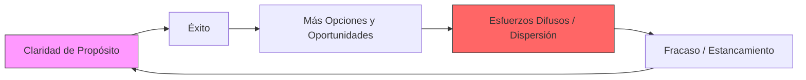

# Análisis Profundo: Esencialismo

El esencialismo no es una estrategia de gestión del tiempo, sino una **disciplina de vida** que consiste en discernir lo que es vital de lo trivial para dar nuestra máxima contribución a lo que realmente importa.

## I. La Paradoja del Éxito

McKeown explica por qué las personas exitosas a menudo terminan estancadas. El éxito puede ser un catalizador del fracaso si no se gestiona de forma esencialista.

---

## II. El Método Esencialista: Los Cuatro Pilares

### 1. Esencia: La Mentalidad
*   **Elegir:** Reconocer que la capacidad de elegir es un poder invencible que nadie nos puede quitar, aunque a menudo lo cedemos por olvido o presión.
*   **Discernir:** Entender la "Ley de las pocas cosas vitales" (Principio de Pareto). Casi todo es ruido; muy pocas cosas tienen un valor excepcional.
*   **Compensar:** Aceptar que no podemos tenerlo todo. La pregunta no es "¿Cómo puedo hacer ambas cosas?", sino "**¿Qué problema quiero resolver?**".

### 2. Explorar: Distinguir las Pocas Cosas Vitales
Para ser selectivos, primero debemos explorar ampliamente nuestras opciones:
*   **Escapar:** Crear espacios de soledad para pensar. "Sin una gran soledad, ningún trabajo serio es posible" (Picasso).
*   **Mirar:** Actuar como un periodista, buscando el "encabezado" o el meollo de nuestra vida entre los detalles triviales.
*   **Jugar:** El juego expande la mente, reduce el estrés y fomenta la plasticidad cerebral.
*   **Dormir:** El sueño es el motor del alto rendimiento. "Proteger el activo" (nosotros mismos) es la máxima prioridad.
*   **Seleccionar:** Aplicar la **Regla del 90%**: Si evaluamos una opción con un puntaje menor a 90 sobre 100, la respuesta automática es **NO**.

### 3. Eliminar: Deshacerse de lo Trivial
*   **Aclarar:** Definir una "Intención Esencial" que sea a la vez concreta e inspiradora.
*   **Atreverse:** Aprender a decir un "No" elegante. Intercambiar popularidad a corto plazo por respeto a largo plazo.
*   **Líbrate de compromisos:** Evitar la "trampa de los costos hundidos" (insistir en algo solo porque ya invertimos tiempo/dinero).
*   **Editar:** Ser el editor de nuestra propia vida, eliminando opciones, condensando actividades y corrigiendo el rumbo.
*   **Limitar:** Establecer límites claros para protegernos de las agendas de los demás.

### 4. Ejecutar: Hacer que lo Esencial parezca Fácil
*   **Amortiguar:** Crear "buffers" (márgenes de seguridad). Añadir un 50% de tiempo extra a los cálculos de entrega para absorber lo inesperado.
*   **Resta:** Identificar y eliminar el "obstáculo más lento" (el Herbie) que frena todo el sistema.
*   **Progresar:** Enfocarse en pequeñas victorias. El progreso es la forma más efectiva de motivación humana.
*   **Fluir:** El genio de la rutina. Crear rutinas que conviertan lo esencial en nuestra posición por *default*.
*   **Enfocar:** Sintonizarse con el *Kairós* (momento oportuno/cualitativo) frente al *Cronos* (tiempo cuantitativo).

---

## III. Conclusión: La Vida Esencialista

Vivir como un esencialista es un acto de **revolución silenciosa**. Implica vivir por diseño, no por defecto. En lugar de progresar un milímetro en un millón de direcciones, el esencialista genera un impulso poderoso hacia su punto de contribución más alto.

> *"Si tú no estableces las prioridades de tu vida, alguien más lo hará por ti".*
