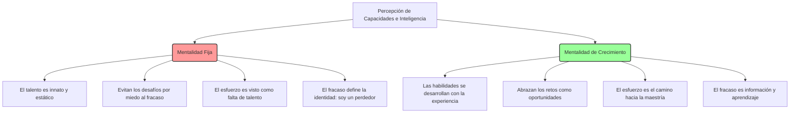

# Análisis Profundo: La Actitud del Éxito (Mindset)

En su obra cumbre, la Dra. Carol S. Dweck redefine la psicología del éxito alejándose del determinismo genético y centrándose en el poder de nuestras creencias. El libro postula que no es el talento innato ni las capacidades estáticas lo que determina el éxito de una persona, sino su **mentalidad** (mindset).

## Las Dos Mentalidades

Dweck categoriza las creencias fundamentales sobre nuestras capacidades en dos grandes grupos:

### 1. La Mentalidad Fija (Fixed Mindset)
Las personas con esta mentalidad creen que sus capacidades están "talladas en piedra". Sienten la necesidad constante de probar su inteligencia. 
*   **Relación con el esfuerzo:** Creen que si tienes que esforzarte, significa que no eres lo suficientemente inteligente o talentoso.
*   **Relación con el fracaso:** El fracaso es devastador y vergonzoso. Un solo error o mala calificación los etiqueta automáticamente como "perdedores". A menudo recurren a excusas, culpan a otros o abandonan por completo para proteger su ego.

### 2. La Mentalidad de Crecimiento (Growth Mindset)
Creen que los talentos y aptitudes básicas pueden cultivarse a través del esfuerzo, buenas estrategias y retroalimentación de los demás.
*   **Relación con el esfuerzo:** Es el componente esencial del éxito. La pasión y la dedicación superan al talento natural a largo plazo.
*   **Relación con el fracaso:** Aunque duele, el fracaso no los define. Lo ven como un problema a resolver y una oportunidad invaluable para aprender, ajustando sus estrategias (como el ejemplo de Michael Jordan analizando sus debilidades y trabajando incansablemente en ellas).

---

## Origen y Propagación de las Mentalidades

Las mentalidades comienzan a formarse desde la primera infancia, moldeadas profundamente por el lenguaje de los padres y educadores.

*   **El peligro de elogiar el talento:** Elogiar a un niño por "ser muy inteligente" o "tener un talento natural" fomenta directamente una mentalidad fija. Les enseña que el amor y el valor están condicionados a los resultados y que deben evitar tareas difíciles para no perder su estatus de "niño listo".
*   **El poder de elogiar el proceso:** Para fomentar una mentalidad de crecimiento, se debe elogiar **el esfuerzo, la perseverancia, las estrategias utilizadas y el enfoque**. Frases como *"Me impresiona cómo probaste diferentes maneras de resolver este problema"* enseñan que el valor reside en el aprendizaje y el trabajo duro.

---

## Cómo Cambiar a una Mentalidad de Crecimiento

El cambio no ocurre de la noche a la mañana. La terapia cognitiva y la autoconciencia son claves. Dweck propone un proceso de 4 pasos cíclicos:

1.  **Aceptar:** Reconoce y abraza tu mentalidad fija. Todos tenemos áreas donde domina (por ejemplo, tener mentalidad de crecimiento en el trabajo pero fija en las relaciones amorosas). No hay de qué avergonzarse.
2.  **Identificar desencadenantes:** Observa qué situaciones activan tu mentalidad fija. ¿Es frente a un reto grande? ¿Cuando alguien te critica? ¿Cuando un compañero tiene mucho éxito?
3.  **Nombrar:** Ponle un nombre (incluso el de un personaje que no te agrade) a esa "voz interior" de tu mentalidad fija. Esto ayuda a externalizarla y quitarle poder sobre tu identidad.
4.  **Educar:** Dialoga con esa mentalidad. Cuando intente frenarte ("no eres lo suficientemente bueno para esto"), respóndele desde la mentalidad de crecimiento ("tal vez no todavía, pero aprenderé cómo hacerlo").

## Conclusión
La "Actitud del Éxito" no consiste en la creencia mágica de que puedes lograr cualquier cosa solo con desearlo, sino en la convicción racional de que **el desarrollo humano es expansivo**. Adoptar una mentalidad de crecimiento nos libera de la tiranía del talento innato y nos empodera para tomar el control de nuestra propia evolución a través del aprendizaje continuo y la resiliencia.