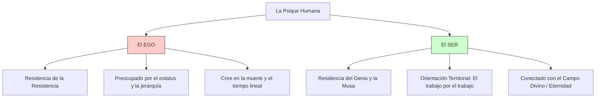

# Análisis Profundo: La Guerra del Arte

Este libro explora la batalla interna que todo individuo enfrenta cuando intenta pasar de un nivel inferior a uno superior en su vocación, ya sea en el arte, los negocios o el crecimiento personal.

## I. El Enemigo: La Resistencia

La **Resistencia** es una fuerza universal cuyo único objetivo es impedirnos realizar nuestro trabajo creativo o vocacional.

### Características de la Resistencia:
*   **Invisible e Interna:** No es un factor externo; nace de nuestro interior.
*   **Insidiosa:** Te dirá cualquier cosa para que no trabajes (justificaciones, miedos, dudas).
*   **Implacable:** No se puede razonar con ella ni negociar. Es como un motor de destrucción programado.
*   **Inmune al éxito:** La Resistencia nunca duerme; Henry Fonda seguía vomitando antes de salir a escena a los 75 años.
*   **Se alimenta del miedo:** Cuanto más miedo sientas ante una tarea, más importante es esa tarea para la evolución de tu alma.

### Manifestaciones comunes:
*   **Procrastinación:** La forma más común; no decimos "nunca lo haré", sino "lo haré mañana".
*   **Drama Personal:** Crear crisis innecesarias en nuestra vida para distraernos del trabajo real.
*   **Auto-medicación:** Uso de sustancias o distracciones (redes sociales, compras) para callar la voz del genio interior.
*   **Victimización:** Adoptar el papel de víctima para evitar la responsabilidad de crear.

---

## II. El Arma: Ser un Profesional

Vencer a la Resistencia no es cuestión de talento, sino de **actitud**. Pressfield distingue entre el *Amateur* (aficionado) y el *Profesional*.

| Característica | Amateur | Profesional |
| :--- | :--- | :--- |
| **Dedicación** | Cuando tiene ganas / inspiración. | Se presenta todos los días, llueva o truene. |
| **Motivación** | Por placer o validación externa. | Por vocación y compromiso con el oficio. |
| **Miedo** | Deja que el miedo lo paralice. | Actúa a pesar del miedo. |
| **Identidad** | Se identifica con su éxito/fracaso. | Se distancia de su obra (desapego). |
| **Técnica** | Cree en el misterio y la magia. | Se dedica a dominar la técnica. |

### Reglas del Profesional:
1.  **Presentarse diario:** El acto de sentarse a trabajar es la victoria más grande.
2.  **Permanecer en el trabajo todo el día:** No abandonar cuando surgen dificultades.
3.  **Compromiso a largo plazo:** Entender que la maestría es una maratón, no un sprint.
4.  **Aceptar la adversidad:** El profesional sabe que el mundo es injusto y sigue adelante.

---

## III. El Reino Superior: Musas y Ángeles

Cuando vencemos a la Resistencia mediante la disciplina profesional, las fuerzas del universo (Musas, Ángeles o el Inconsciente Colectivo) vienen en nuestra ayuda.

### Dualidad Psicológica (Modelo Junguiano)

---

## IV. Territorio vs. Jerarquía

Pressfield sostiene que el artista debe tener una **orientación territorial**, no jerárquica.
*   **Jerárquica:** El individuo se define por su posición respecto a los demás (competencia, celos, validación). Es el terreno de la Resistencia.
*   **Territorial:** El individuo se define por su relación con su "terreno de caza" (el lienzo, el código, el gimnasio). El territorio te devuelve exactamente la energía que le pones.

---

## V. Conclusión: Haz tu trabajo

El trabajo creativo no es un acto de egoísmo, sino una demanda del universo. No realizar nuestra obra es una traición a nosotros mismos y al mundo.

> *"Algo terminado es mejor que algo perfecto".*
