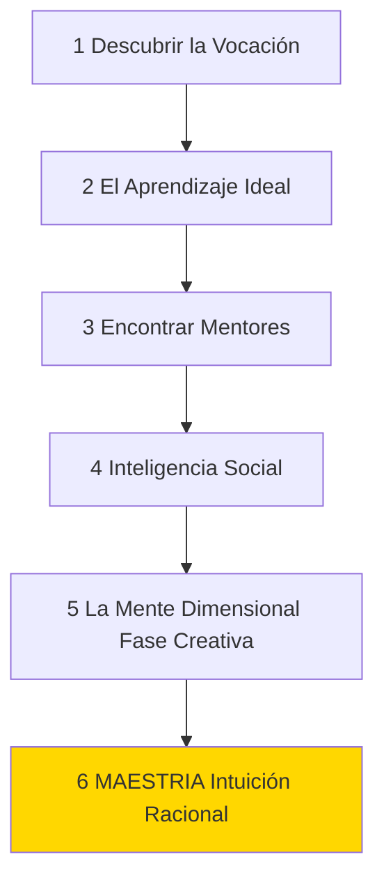

# Análisis Profundo: Maestría

En este libro, Robert Greene desmitifica la idea del "genio innato" o el talento natural. Argumenta que la maestría es el resultado de un proceso riguroso y predecible que cualquier persona puede seguir, ilustrado a través de las biografías de figuras históricas como Leonardo da Vinci, Charles Darwin, Albert Einstein y maestros contemporáneos.

## El Camino hacia la Maestría

El proceso para alcanzar la maestría no es un atajo, sino un camino de transformación profunda que se divide en fases secuenciales.

---

## Fases del Desarrollo del Maestro

### 1. Descubre tu llamado (Tu Tarea en la Vida)
Todo individuo tiene una "voz interior" o inclinación única (su ADN psicológico). El primer paso es reconectarse con esta fuerza, que a menudo se manifiesta en la infancia como una curiosidad obsesiva.
*   **Estrategias:** Volver a los orígenes, ocupar el nicho perfecto (la estrategia darwiniana), evitar caminos falsos (la rebelión contra las expectativas parentales/sociales) y transformar las deficiencias en ventajas (como el caso de Temple Grandin).

### 2. Ríndete a la realidad: El Aprendizaje Ideal
Después de la educación formal, comienza el aprendizaje real. No se trata de ganar dinero o títulos, sino de adquirir conocimientos prácticos y transformar la mente.
*   **Fase 1: Observación profunda.** Asimilar pasivamente las reglas y dinámicas de poder del nuevo entorno sin intentar destacar de inmediato.
*   **Fase 2: Adquisición de habilidades.** Práctica intensa y repetitiva (práctica profunda). Al principio es tedioso, pero la repetición reconfigura las conexiones neuronales hasta que la habilidad se vuelve automática.
*   **Fase 3: Experimentación.** Tomar la iniciativa, aplicar lo aprendido y exponerse a la crítica y al fracaso para medir el progreso real.

### 3. Asimila el poder del maestro (La Dinámica del Mentor)
La vida es demasiado corta para aprenderlo todo por ensayo y error. Un mentor acelera el proceso al destilar años de experiencia.
*   **La Meta:** Absorber el conocimiento del mentor hasta igualarlo, para luego superarlo y encontrar tu propio camino (matar a la figura paterna intelectualmente). No busques mentores solo por su estatus, sino por la afinidad con tu tarea en la vida.

### 4. Ve a la gente como es: Inteligencia Social
El mayor obstáculo en la búsqueda de la maestría es el desgaste emocional causado por las manipulaciones y dramas humanos.
*   Debes abandonar la "perspectiva ingenua" y desarrollar un desapego clínico. Aprende a leer las verdaderas intenciones de la gente (envidia, rigidez, pereza, agresión pasiva) y evita enredarte en batallas políticas que te distraen de tu verdadero trabajo.

### 5. Descubre la Mente Dimensional (Fase Creativa-Activa)
A medida que acumulas conocimientos, la mente tiende a volverse rígida y convencional. La fase creativa exige romper las reglas que acabas de aprender.
*   **Capacidad Negativa:** Mantener la mente abierta al misterio y la duda, sin apresurarse a conclusiones.
*   **Pensamiento Holístico:** Ver el "panorama completo" en lugar de perderse en especializaciones estrechas. Combinar disciplinas de formas novedosas.

### 6. Funde lo intuitivo con lo racional (La Maestría)
Después de miles de horas de inmersión (generalmente alrededor de 10,000 horas o 10 a 20 años), el conocimiento tácito se funde con el cerebro.
*   El maestro ya no necesita pensar paso a paso; tiene una aprehensión repentina e inmediata de la realidad de su campo. Esta **intuición de alto nivel** no es magia, es el resultado del procesamiento veloz de millones de piezas de información almacenadas a lo largo de décadas de práctica profunda.

---

## Conclusión y Acción Inmediata
El genio se hace, no se nace. La pasividad y el deseo de gratificación instantánea de la cultura moderna son los verdaderos enemigos de la maestría.
*   **Acción:** Reevalúa tu trabajo actual no por el dinero o el prestigio que te otorga, sino por las oportunidades de **aprendizaje y desarrollo de habilidades** que te ofrece. Prioriza siempre el aprendizaje sobre la ganancia financiera a corto plazo.
